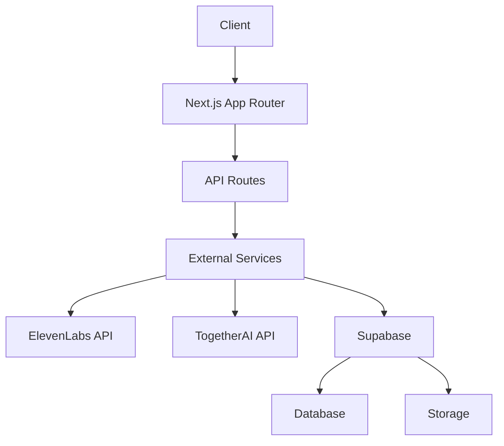

# AI24 News Generator

A modern web application that generates AI-powered visualizations for news headlines using advanced AI models and real-time media generation.

## 🚀 Features

- Real-time news fetching from trusted sources
- AI-powered image generation with artistic styles
- Text-to-speech audio generation with word-level alignment
- Rate limiting and subscription management
- Responsive, modern UI with dark mode support
- Real-time progress tracking for media generation

## 🏗️ Architecture



See [Architecture Documentation](./docs/architecture.md) for detailed diagrams and explanations.

## 🛠️ Tech Stack

- **Framework**: Next.js 14 with App Router
- **Styling**: Tailwind CSS with custom UI components
- **State Management**: Jotai for global state
- **Database**: Supabase (PostgreSQL)
- **Storage**: Supabase Storage
- **AI Services**: 
  - TogetherAI for image generation
  - ElevenLabs for text-to-speech
- **Type Safety**: TypeScript with strict mode
- **Testing**: Jest and React Testing Library

## 📚 Documentation

- [Architecture Overview](./docs/architecture.md)
- [State Management](./docs/state-management.md)
- [Media Generation Flow](./docs/media-generation.md)
- [API Integration](./docs/api-integration.md)
- [Database Schema](./docs/database.md)
- [UI Components](./docs/ui-components.md)
- [Development Guide](./docs/development.md)

## 🚀 Getting Started

1. Clone the repository
2. Install dependencies:
   ```bash
   npm install
   ```
3. Set up environment variables:
   ```bash
   cp .env.example .env.local
   ```
4. Start the development server:
   ```bash
   npm run dev
   ```

## 🔑 Environment Variables

Required environment variables:
- `NEXT_PUBLIC_SUPABASE_URL`
- `NEXT_PUBLIC_SUPABASE_ANON_KEY`
- `SUPABASE_SERVICE_ROLE_KEY`
- `ELEVEN_LABS_API_KEY`
- `TOGETHER_API_KEY`

## 📝 License

MIT
