# API Integration

> **Note**: This document details the application's API integration approach, including external service integration, request handling, and error management.

## Overview

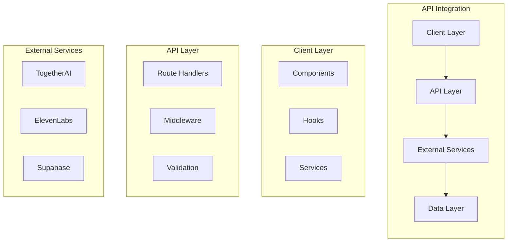

## API Architecture

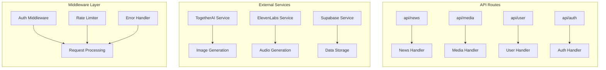

## Request Flow

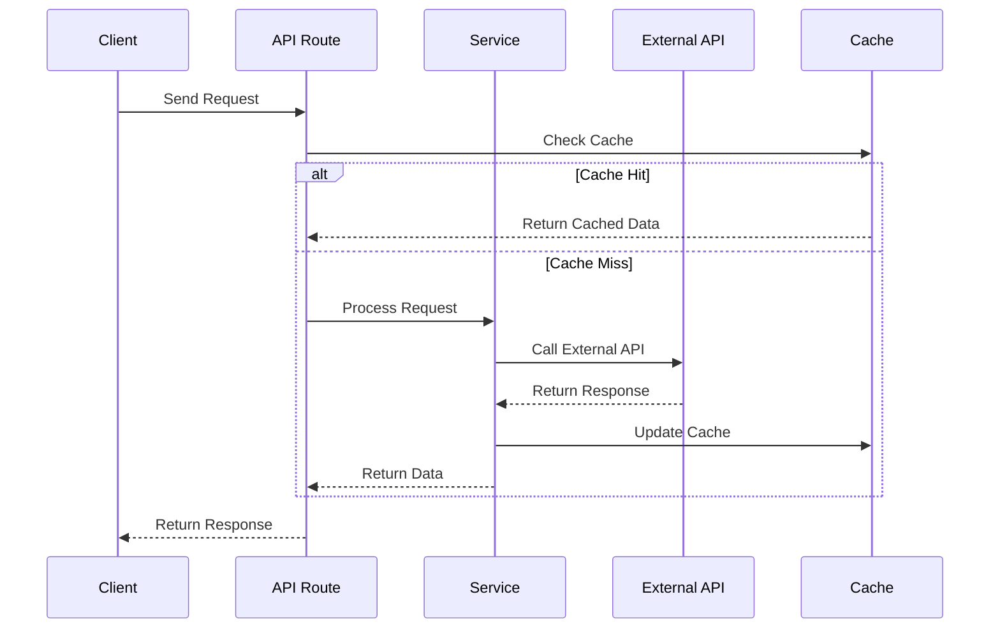

## Implementation Details

### 1. API Client

```typescript
class APIClient {
  private static instance: APIClient
  private baseURL: string
  private headers: HeadersInit

  private constructor() {
    this.baseURL = process.env.NEXT_PUBLIC_API_URL
    this.headers = {
      'Content-Type': 'application/json',
      'Authorization': `Bearer ${process.env.NEXT_PUBLIC_API_KEY}`
    }
  }

  static getInstance(): APIClient {
    if (!APIClient.instance) {
      APIClient.instance = new APIClient()
    }
    return APIClient.instance
  }

  async request<T>(endpoint: string, options: RequestInit = {}): Promise<T> {
    const response = await fetch(`${this.baseURL}${endpoint}`, {
      ...options,
      headers: {
        ...this.headers,
        ...options.headers
      }
    })

    if (!response.ok) {
      throw new APIError(response.status, await response.text())
    }

    return response.json()
  }
}
```

### 2. Rate Limiting

```typescript
class RateLimiter {
  private requests: Map<string, number[]>
  private limit: number
  private window: number

  constructor(limit: number, window: number) {
    this.requests = new Map()
    this.limit = limit
    this.window = window
  }

  isAllowed(key: string): boolean {
    const now = Date.now()
    const timestamps = this.requests.get(key) || []
    
    // Remove old timestamps
    const recent = timestamps.filter(t => now - t < this.window)
    
    if (recent.length >= this.limit) {
      return false
    }
    
    recent.push(now)
    this.requests.set(key, recent)
    return true
  }
}
```

### 3. Error Handling

```typescript
class APIError extends Error {
  constructor(
    public status: number,
    message: string,
    public code?: string
  ) {
    super(message)
    this.name = 'APIError'
  }
}

function handleAPIError(error: unknown): APIError {
  if (error instanceof APIError) {
    return error
  }

  if (error instanceof Error) {
    return new APIError(500, error.message)
  }

  return new APIError(500, 'An unknown error occurred')
}
```

## Performance Optimizations

### 1. Caching Strategy

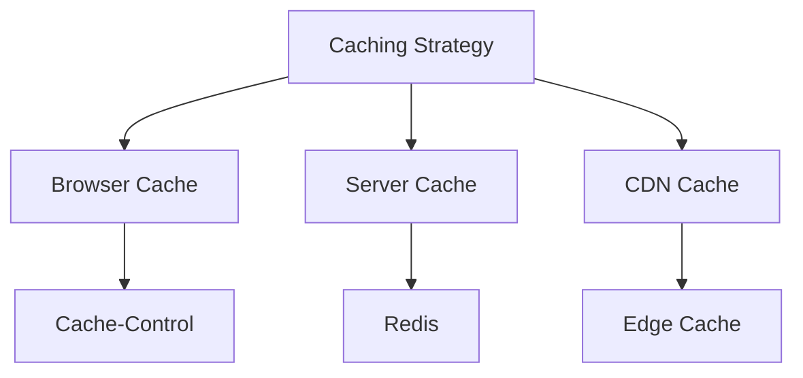

### 2. Request Batching

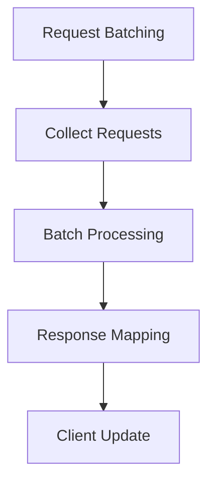

### 3. Retry Logic

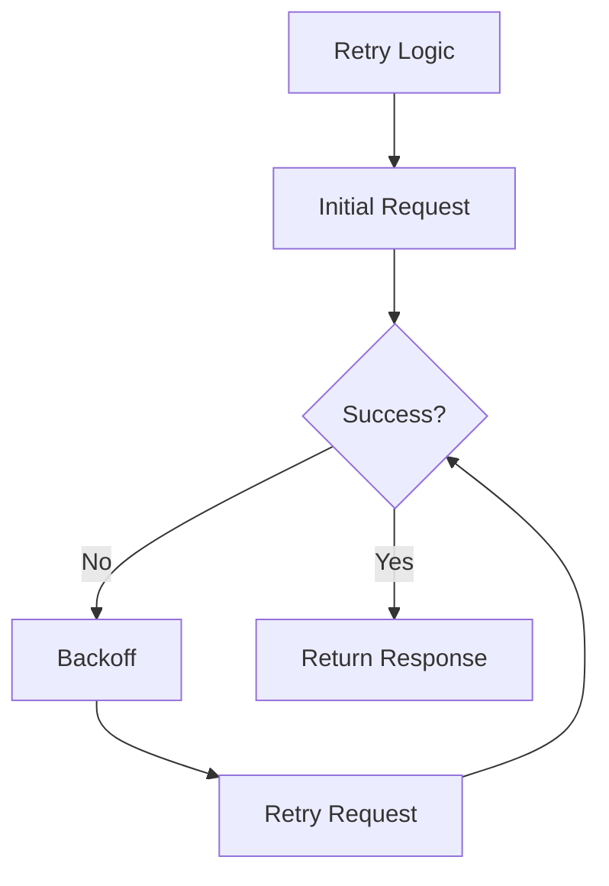

## Security Measures

### 1. API Key Management

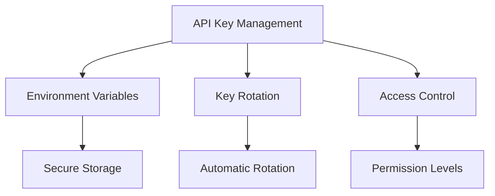

### 2. Request Validation

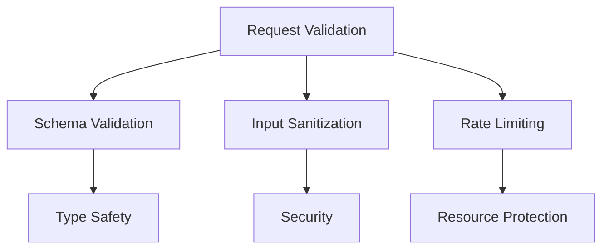

### 3. Response Security

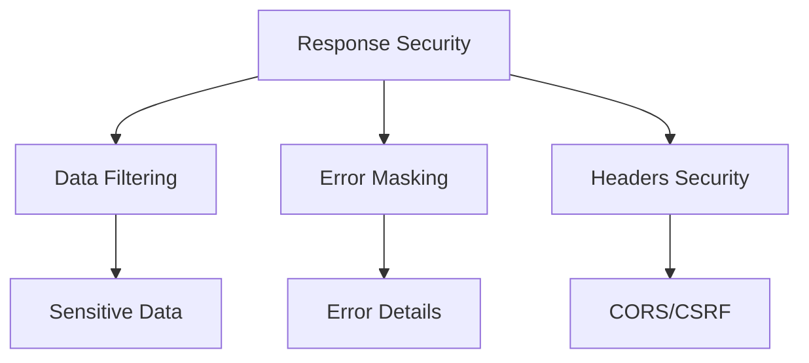

## Monitoring and Logging

### 1. Performance Metrics

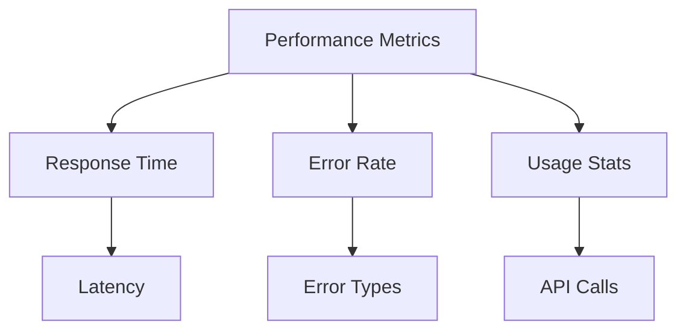

### 2. Error Tracking

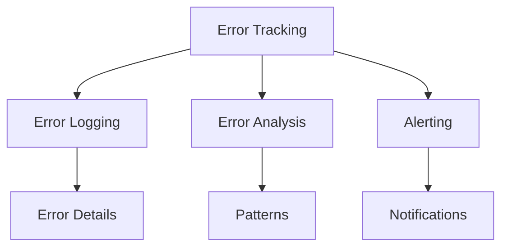

### 3. Usage Analytics

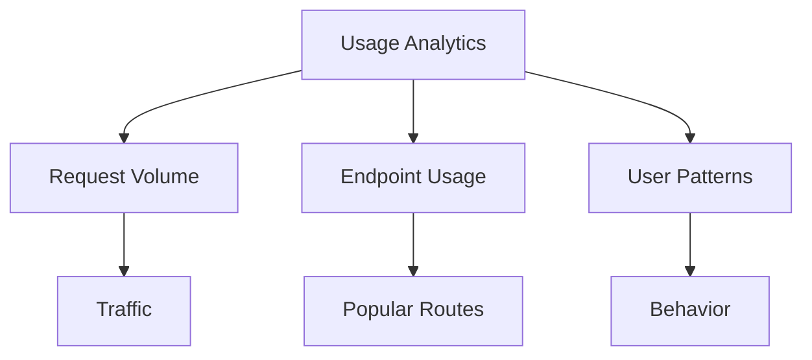

## Future Improvements

### 1. Scalability

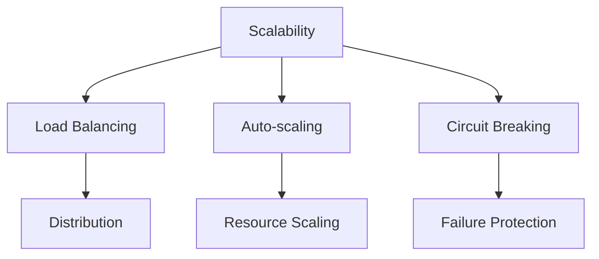

### 2. Monitoring

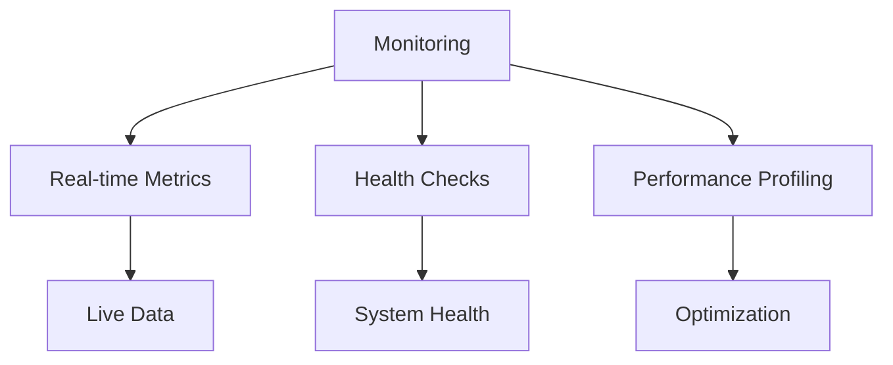

### 3. Developer Experience

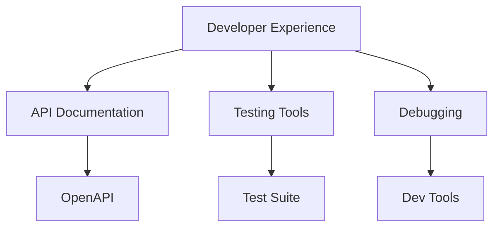

> **Note**: The color scheme used in the diagrams follows a consistent pattern:
> - Client Layer: Blue (#3B82F6)
> - API Layer: Purple (#8B5CF6)
> - External Services: Green (#10B981)
> - Data Layer: Orange (#F59E0B)
> - Routes: Pink (#EC4899)
> - Services: Purple (#8B5CF6)
> - Middleware: Yellow (#F59E0B)
> - Error: Red (#EF4444)
> - Success: Green (#10B981) 