# API Integration

> **Note**: This document details the application's API integration approach, including external service integration, request handling, and error management.

## Overview

This document outlines the integration with external APIs, particularly focusing on the ElevenLabs API for text-to-speech generation.

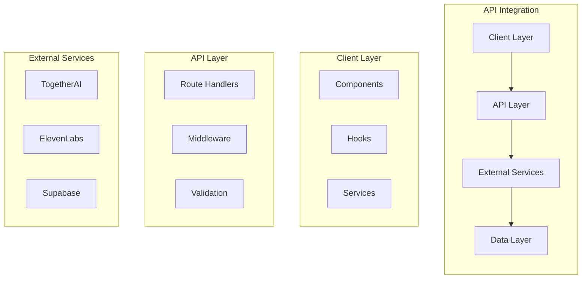

## API Architecture

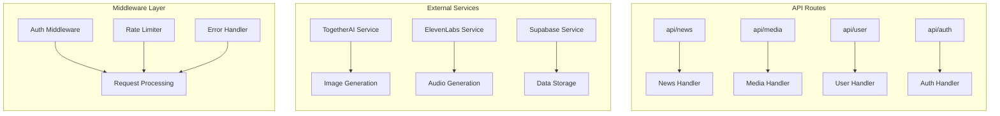

## Request Flow

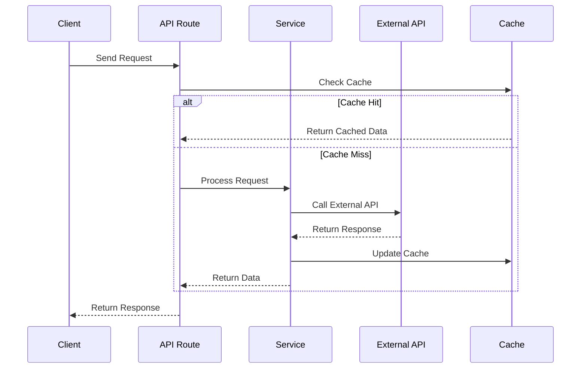

## Implementation Details

### 1. API Client

```typescript
// API Error Types
class APIError extends Error {
  constructor(
    public status: number,
    message: string,
    public code?: string,
    public retryable: boolean = false
  ) {
    super(message)
    this.name = 'APIError'
  }
}

class RateLimitError extends APIError {
  constructor(message: string) {
    super(429, message, 'RATE_LIMIT', true)
    this.name = 'RateLimitError'
  }
}

class ValidationError extends APIError {
  constructor(message: string) {
    super(400, message, 'VALIDATION_ERROR', false)
    this.name = 'ValidationError'
  }
}

// Retry Configuration
interface RetryConfig {
  maxAttempts: number
  baseDelay: number
  maxDelay: number
  backoffFactor: number
}

const DEFAULT_RETRY_CONFIG: RetryConfig = {
  maxAttempts: 3,
  baseDelay: 1000,
  maxDelay: 10000,
  backoffFactor: 2
}

// Retry Logic
async function withRetry<T>(
  operation: () => Promise<T>,
  config: RetryConfig = DEFAULT_RETRY_CONFIG
): Promise<T> {
  let lastError: Error
  let delay = config.baseDelay

  for (let attempt = 1; attempt <= config.maxAttempts; attempt++) {
    try {
      return await operation()
    } catch (error) {
      lastError = error as Error
      
      if (!(error instanceof APIError) || !error.retryable) {
        throw error
      }

      if (attempt === config.maxAttempts) {
        throw error
      }

      await new Promise(resolve => setTimeout(resolve, delay))
      delay = Math.min(delay * config.backoffFactor, config.maxDelay)
    }
  }

  throw lastError
}

// API Client with Retry
class APIClient {
  constructor(
    private baseUrl: string,
    private apiKey: string,
    private retryConfig: RetryConfig = DEFAULT_RETRY_CONFIG
  ) {}

  async request<T>(
    endpoint: string,
    options: RequestInit = {}
  ): Promise<T> {
    return withRetry(
      async () => {
        const response = await fetch(`${this.baseUrl}${endpoint}`, {
          ...options,
          headers: {
            'Authorization': `Bearer ${this.apiKey}`,
            'Content-Type': 'application/json',
            ...options.headers
          }
        })

        if (!response.ok) {
          const error = await this.handleError(response)
          throw error
        }

        return response.json()
      },
      this.retryConfig
    )
  }

  private async handleError(response: Response): Promise<APIError> {
    const data = await response.json().catch(() => ({}))
    
    switch (response.status) {
      case 429:
        return new RateLimitError(data.message || 'Rate limit exceeded')
      case 400:
        return new ValidationError(data.message || 'Invalid request')
      default:
        return new APIError(
          response.status,
          data.message || 'An unknown error occurred',
          data.code,
          response.status >= 500
        )
    }
  }
}

// Usage Example
const api = new APIClient('https://api.example.com', 'your-api-key')

try {
  const result = await api.request('/audio/generate', {
    method: 'POST',
    body: JSON.stringify({
      text: 'Hello, world!',
      voiceId: 'voice-123'
    })
  })
  console.log('Success:', result)
} catch (error) {
  if (error instanceof RateLimitError) {
    console.error('Rate limit exceeded, please try again later')
  } else if (error instanceof ValidationError) {
    console.error('Invalid request:', error.message)
  } else {
    console.error('API error:', error.message)
  }
}
```

### 2. Rate Limiting

```typescript
class RateLimiter {
  private requests: Map<string, number[]>
  private limit: number
  private window: number

  constructor(limit: number, window: number) {
    this.requests = new Map()
    this.limit = limit
    this.window = window
  }

  isAllowed(key: string): boolean {
    const now = Date.now()
    const timestamps = this.requests.get(key) || []
    
    // Remove old timestamps
    const recent = timestamps.filter(t => now - t < this.window)
    
    if (recent.length >= this.limit) {
      return false
    }
    
    recent.push(now)
    this.requests.set(key, recent)
    return true
  }
}
```

### 3. Error Handling

```typescript
class APIError extends Error {
  constructor(
    public status: number,
    message: string,
    public code?: string
  ) {
    super(message)
    this.name = 'APIError'
  }
}

function handleAPIError(error: unknown): APIError {
  if (error instanceof APIError) {
    return error
  }

  if (error instanceof Error) {
    return new APIError(500, error.message)
  }

  return new APIError(500, 'An unknown error occurred')
}
```

## Performance Optimizations

### 1. Caching Strategy

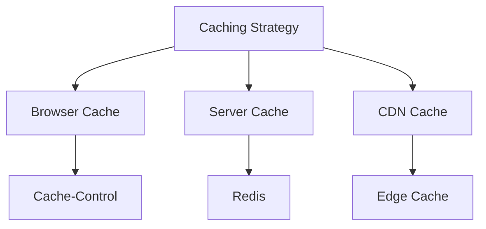

### 2. Request Batching

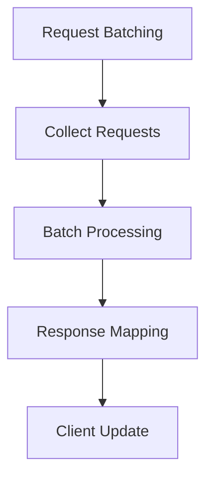

### 3. Retry Logic

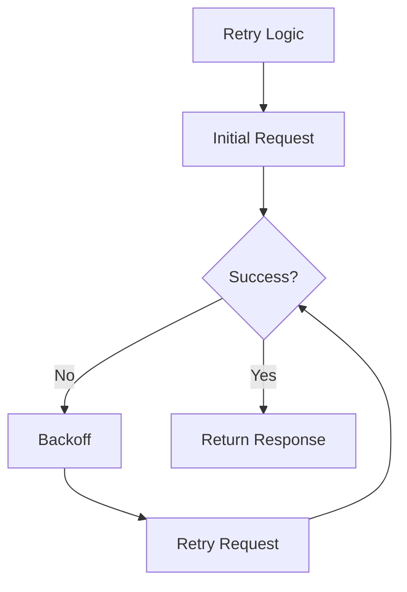

## Security Measures

### 1. API Key Management

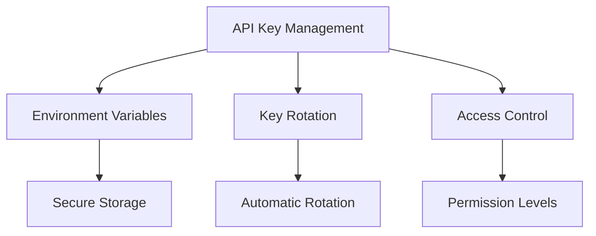

### 2. Request Validation

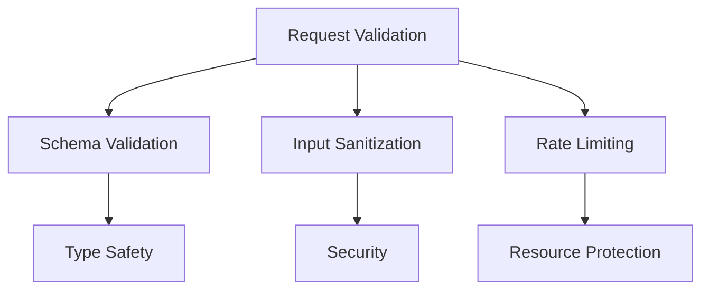

### 3. Response Security

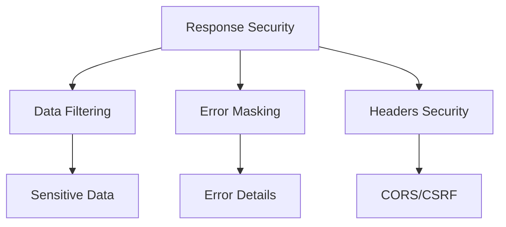

## Monitoring and Logging

### 1. Performance Metrics

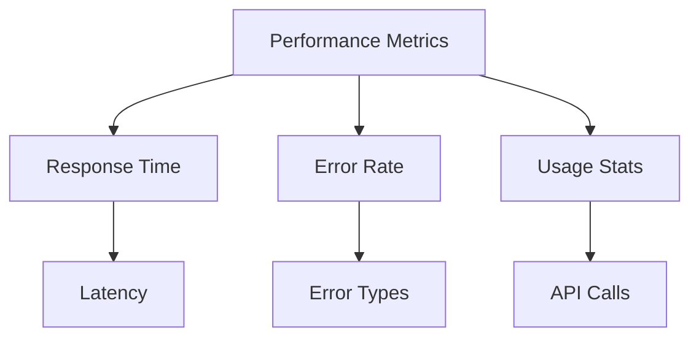

### 2. Error Tracking

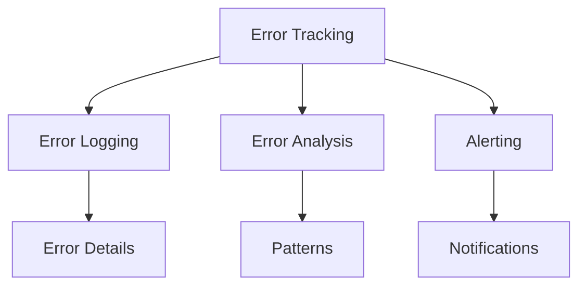

### 3. Usage Analytics

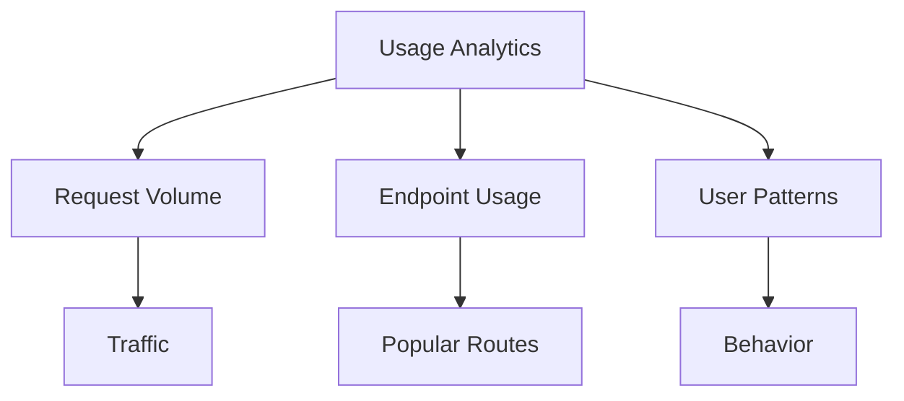

## Future Improvements

### 1. Scalability

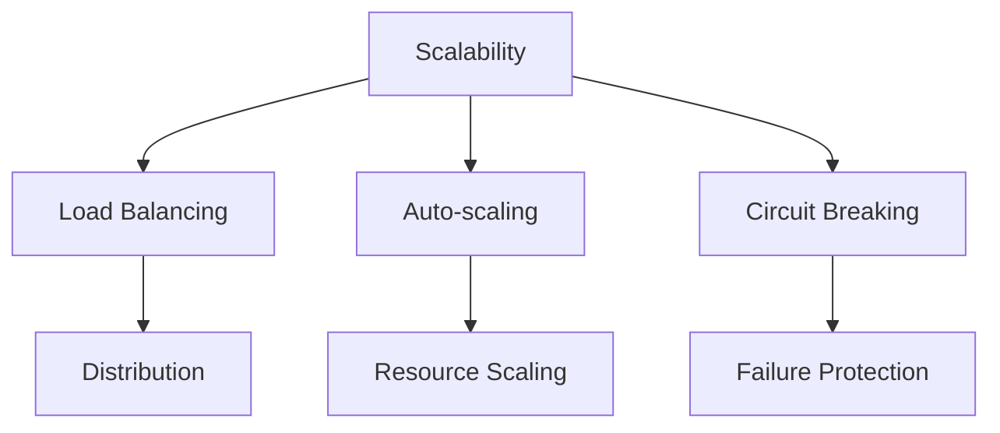

### 2. Monitoring

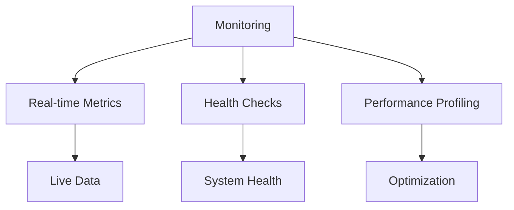

### 3. Developer Experience

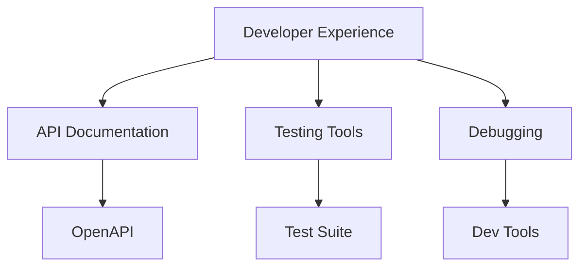

## ElevenLabs Integration

### Step-by-Step Implementation Guide

<details>
<summary>📋 Step 1: Configure the API Client</summary>

```typescript
// 1. Install required dependencies
// npm install axios 

// 2. Create config file (lib/config/elevenlabs.ts)
export const ELEVENLABS_CONFIG = {
  apiKey: process.env.ELEVENLABS_API_KEY,
  baseUrl: 'https://api.elevenlabs.io/v1',
  defaultVoiceId: '21m00Tcm4TlvDq8ikWAM',
  defaultModelId: 'eleven_monolingual_v1',
};
```
</details>

<details>
<summary>📋 Step 2: Create the API Service</summary>

```typescript
// lib/services/elevenlabs.ts
import axios from 'axios';
import { ELEVENLABS_CONFIG } from '../config/elevenlabs';

export class ElevenLabsService {
  private config = ELEVENLABS_CONFIG;
  
  constructor() {
    if (!this.config.apiKey) {
      console.warn('ElevenLabs API key not found');
    }
  }
  
  async generateSpeech(text: string, voiceId = this.config.defaultVoiceId) {
    try {
      const response = await axios.post(
        `${this.config.baseUrl}/text-to-speech/${voiceId}/stream`,
        { text },
        {
          headers: {
            'xi-api-key': this.config.apiKey,
            'Content-Type': 'application/json',
          },
          responseType: 'arraybuffer',
        }
      );
      
      return response.data;
    } catch (error) {
      console.error('Error generating speech:', error);
      throw error;
    }
  }
}

export const elevenLabsService = new ElevenLabsService();
```
</details>

<details>
<summary>📋 Step 3: Create the API Route</summary>

```typescript
// app/api/generate-audio/route.ts
import { NextResponse } from 'next/server';
import { elevenLabsService } from '@/lib/services/elevenlabs';

export async function POST(request: Request) {
  try {
    const { text, voiceId } = await request.json();
    
    // Generate speech
    const audioData = await elevenLabsService.generateSpeech(text, voiceId);
    
    // ... handle storage and processing
    
    return NextResponse.json({ 
      status: 'success',
      audioUrl: 'url-to-stored-audio',
    });
  } catch (error) {
    return NextResponse.json(
      { status: 'error', message: error.message },
      { status: 500 }
    );
  }
}
```
</details>

<details>
<summary>📋 Step 4: Create the Client Hook</summary>

```typescript
// hooks/useAudioGeneration.ts
import { useState } from 'react';

export function useAudioGeneration() {
  const [isGenerating, setIsGenerating] = useState(false);
  const [error, setError] = useState<Error | null>(null);
  
  const generateAudio = async (text: string, voiceId?: string) => {
    setIsGenerating(true);
    setError(null);
    
    try {
      const response = await fetch('/api/generate-audio', {
        method: 'POST',
        headers: { 'Content-Type': 'application/json' },
        body: JSON.stringify({ text, voiceId }),
      });
      
      if (!response.ok) {
        throw new Error('Failed to generate audio');
      }
      
      const data = await response.json();
      return data;
    } catch (error) {
      setError(error);
      throw error;
    } finally {
      setIsGenerating(false);
    }
  };
  
  return { generateAudio, isGenerating, error };
}
```
</details>

<details>
<summary>📋 Step 5: Use in Components</summary>

```tsx
// components/AudioGenerator.tsx
import { useState } from 'react';
import { useAudioGeneration } from '@/hooks/useAudioGeneration';

export function AudioGenerator() {
  const [text, setText] = useState('');
  const { generateAudio, isGenerating, error } = useAudioGeneration();
  const [audioUrl, setAudioUrl] = useState<string | null>(null);
  
  const handleSubmit = async (e: React.FormEvent) => {
    e.preventDefault();
    
    try {
      const result = await generateAudio(text);
      setAudioUrl(result.audioUrl);
    } catch (error) {
      console.error('Failed to generate audio:', error);
    }
  };
  
  return (
    <div>
      <form onSubmit={handleSubmit}>
        <textarea 
          value={text} 
          onChange={(e) => setText(e.target.value)}
          placeholder="Enter text to convert to speech"
          rows={4}
        />
        <button type="submit" disabled={isGenerating || !text}>
          {isGenerating ? 'Generating...' : 'Generate Audio'}
        </button>
      </form>
      
      {error && <div className="error">{error.message}</div>}
      
      {audioUrl && (
        <div>
          <audio src={audioUrl} controls />
        </div>
      )}
    </div>
  );
}
```
</details>

> 💡 **Pro Tip**: Ensure your environment variables are properly set in both development (`.env.local`) and production environments.
