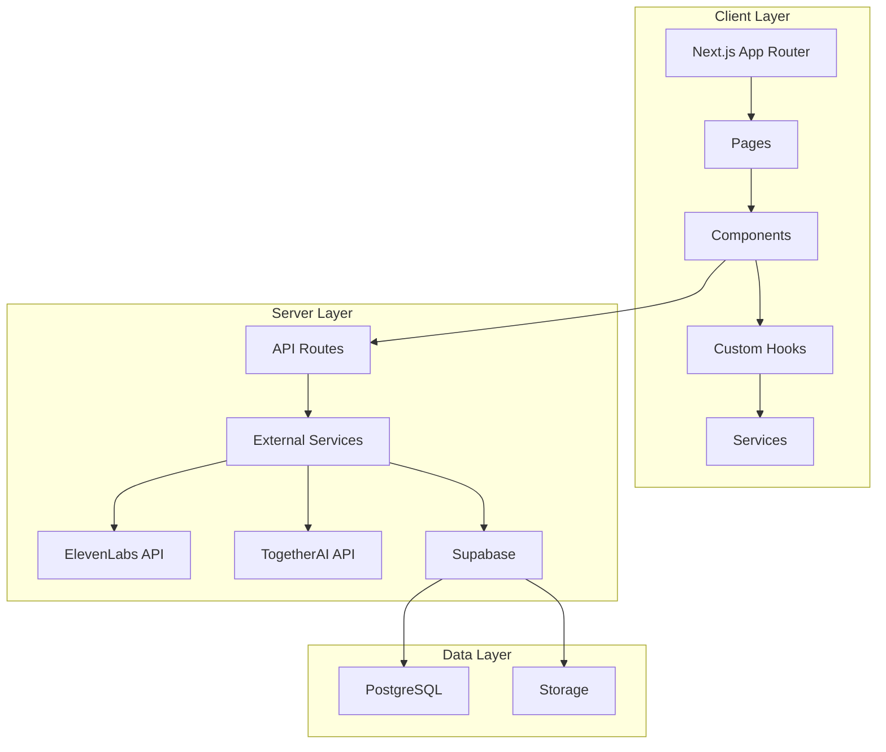
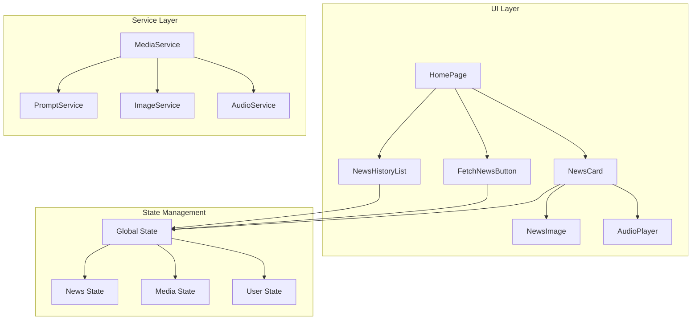

# Architecture Overview

> **Note**: This document provides a comprehensive overview of the application's architecture, including system design, component relationships, and key technical decisions.

## System Architecture

## Component Architecture

## Data Flow

## Key Design Decisions

### 1. Service Layer Architecture

The application uses a service-based architecture to handle complex operations:

| Service | Purpose | Key Features |
|---------|---------|--------------|
| MediaService | Orchestrates media generation | - Progress tracking - Error handling - Resource management |
| PromptService | Handles AI prompt generation | - Style validation - Context management - Output formatting |
| ImageService | Manages image generation | - Format optimization - Storage integration - Caching |
| AudioService | Handles audio generation | - Streaming support - Alignment data - Format conversion |

Each service follows the Singleton pattern to ensure consistent state and resource management.

### 2. State Management

The application uses a hybrid state management approach:

### 3. API Integration

The application integrates with multiple external APIs:

| API | Purpose | Key Features |
|-----|---------|--------------|
| TogetherAI | Image generation | - Style transfer - Resolution control - Batch processing |
| ElevenLabs | Text-to-speech | - Voice selection - Alignment data - Streaming support |
| Supabase | Data/Storage | - Real-time updates - Row-level security - Storage management |

### 4. Database Design

The database schema is designed for:

### 5. UI/UX Considerations

The UI is built with:

## Performance Optimizations

### 1. Image Optimization

### 2. Audio Streaming

### 3. State Updates

### 4. API Calls

## Security Considerations

### 1. API Security

### 2. Data Security

### 3. User Security

## Future Improvements

### 1. Scalability

### 2. Features

### 3. Performance

> **Note**: The color scheme used in the diagrams follows a consistent pattern:
> - Supabase: Green (#10B981)
> - Next.js: Black (#000000)
> - TypeScript: Blue (#3178C6)
> - Services: Purple (#8B5CF6)
> - API Routes: Pink (#EC4899)
> - Hooks: Purple (#8B5CF6)
> - Components: Blue (#3B82F6)
> - State Management: Pink (#EC4899)
> - UI Elements: Red (#EF4444)
> - Layout: Orange (#F59E0B) 