# 🔊 Audio Architecture

> **Note**: This document provides a comprehensive overview of the application's audio system architecture, including Web Audio API integration, state management, and audio processing flow.

---

## 📋 System Overview

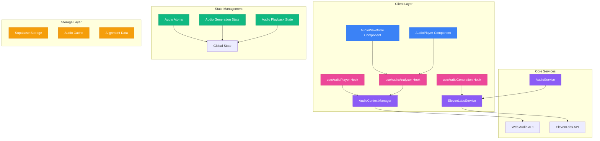

---

## 🔡 Audio Alignment System

### 📊 Data Structures

```typescript
// Raw alignment data from ElevenLabs
interface RawAudioAlignment {
  characters: Array<{
    char: string
    start: number
    end: number
  }>
}

// Normalized alignment data used by the app
interface NormalizedAudioAlignment {
  characters: string[]
  character_start_times_seconds: number[]
  character_end_times_seconds: number[]
}

// Database format (matches what we store in Supabase)
interface DBAudioAlignment extends RawAudioAlignment {}
```

### 🔄 Alignment Flow

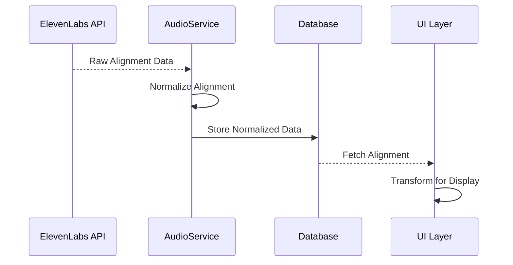

### 🔄 Normalization Process

The alignment data goes through several transformations:

1. **Raw Format** (from ElevenLabs):
```typescript
{
  characters: [
    { char: "H", start: 0.0, end: 0.1 },
    { char: "e", start: 0.1, end: 0.2 },
    // ...
  ]
}
```

2. **Normalized Format** (used by the app):
```typescript
{
  characters: ["H", "e", "l", "l", "o"],
  character_start_times_seconds: [0.0, 0.1, 0.2, 0.3, 0.4],
  character_end_times_seconds: [0.1, 0.2, 0.3, 0.4, 0.5]
}
```

3. **Database Format** (stored in Supabase):
```typescript
{
  characters: [
    { char: "H", start: 0.0, end: 0.1 },
    { char: "e", start: 0.1, end: 0.2 },
    // ...
  ]
}
```

### ✅ Validation

The system includes robust validation for alignment data:

```typescript
function isValidNormalizedAlignment(alignment: NormalizedAudioAlignment): boolean {
  const { characters, character_start_times_seconds, character_end_times_seconds } = alignment

  // Check array lengths match
  if (characters.length !== character_start_times_seconds.length || 
      characters.length !== character_end_times_seconds.length) {
    return false
  }

  // Check for invalid values
  return characters.every((char, i) => {
    const start = character_start_times_seconds[i]
    const end = character_end_times_seconds[i]
    return (
      typeof char === 'string' &&
      typeof start === 'number' &&
      typeof end === 'number' &&
      start >= 0 &&
      end >= start
    )
  })
}
```

### 🧩 Usage in Components

The alignment data is used in several components:

1. **AudioPlayer**: Manages playback and timing
2. **AnimatedTranscript**: Provides character-level highlighting
3. **AudioWaveform**: Visualizes audio frequency data

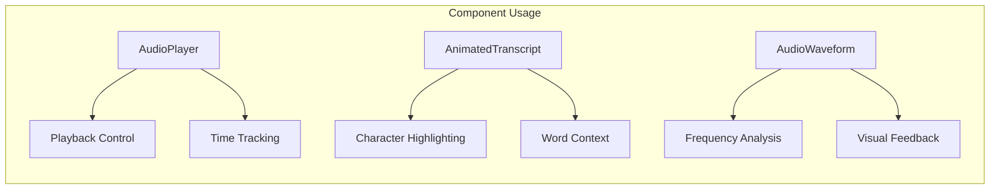

### 🔄 State Management

Alignment data is managed through Jotai atoms:

```typescript
interface AudioTrack {
  id: string
  url: string
  alignment: AudioAlignment | null
  isPlaying: boolean
  currentTime: number
  duration: number
  volume: number
}

// Base state atom
export const audioContextStateAtom = atom<AudioContextState>({
  isInitialized: false,
  error: null,
  activeTrack: null,
  availableTracks: new Map()
})
```

### ⚠️ Error Handling

The system includes comprehensive error handling for alignment data:

```typescript
try {
  const normalized = normalizeAudioAlignment(rawAlignment)
  if (!normalized) {
    throw new Error('Invalid alignment data')
  }
  
  // Store normalized data
  await storeAlignment(normalized)
} catch (error) {
  devLog('Alignment processing failed', {
    prefix: 'audio-alignment',
    level: 'error'
  }, { error })
  
  // Handle error appropriately
}
```

---

## 🧩 Component Architecture

### 🎛️ AudioContextManager

The `AudioContextManager` is a singleton service that manages the Web Audio API context and audio connections:

```typescript
interface AudioConnection {
  analyzer: AnalyserNode
  dataArray: Uint8Array
  source: MediaElementAudioSourceNode
  gainNode: GainNode
  audioElement: HTMLAudioElement
}

interface AudioContextState {
  isInitialized: boolean
  error: Error | null
  activeConnections: Map<string, AudioConnection>
  currentVolume: number
}
```

**Key features**:
- ✅ Singleton pattern for global audio context management
- ✅ Handles audio node connections and cleanup
- ✅ Manages audio analyzer for visualization
- ✅ Provides volume control and state management

### 🎵 Audio Player Components

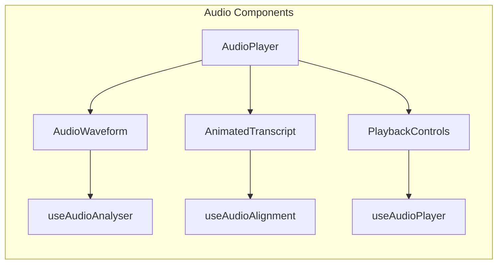

#### AudioPlayer Component
- 🎮 Manages audio element lifecycle
- ⏯️ Handles playback controls
- 🔄 Coordinates with audio context
- 📢 Provides event callbacks

#### AudioWaveform Component
- 📊 Real-time frequency visualization
- 🔍 Uses Web Audio API analyzer
- 📱 Responsive canvas rendering
- 🎨 Dynamic bar visualization

### 🪝 Custom Hooks

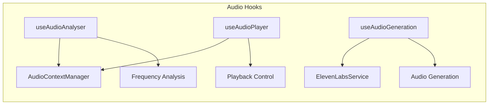

---

## 🔄 Audio Processing Flow

### 1️⃣ Generation Flow

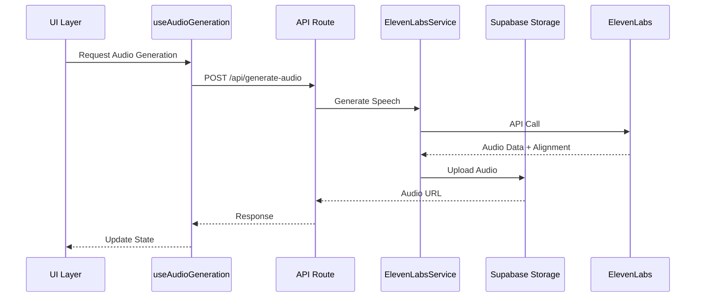

### 2️⃣ Playback Flow

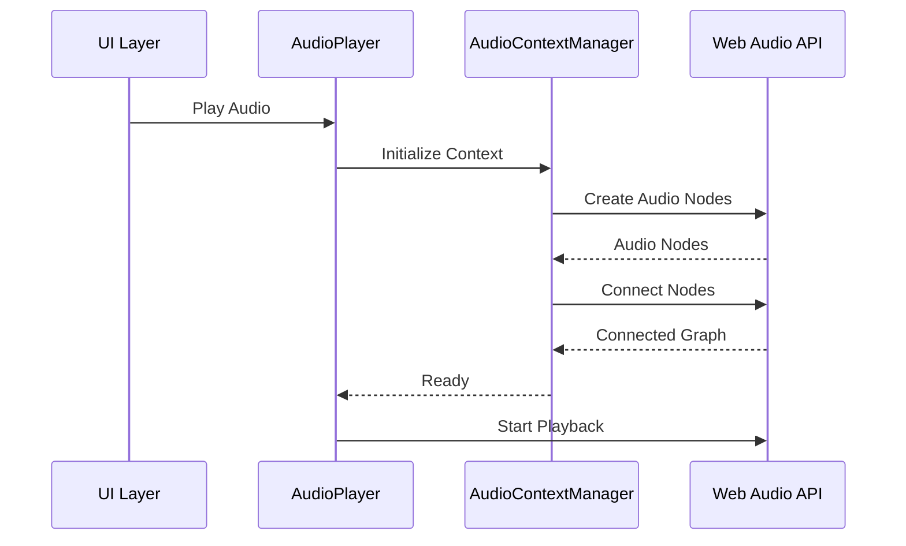

---

## 🔄 State Management

### 🌐 Global State (Jotai Atoms)

```typescript
// Base state atom
export const audioContextStateAtom = atom<AudioContextState>({
  isInitialized: false,
  error: null,
  activeTrack: null,
  availableTracks: new Map()
})

// Action atoms
export const playTrackAtom = atom(
  null,
  async (get, set, trackId: string) => {
    // Playback logic
  }
)

export const pauseTrackAtom = atom(
  null,
  async (get, set) => {
    // Pause logic
  }
)
```

### 🧩 Component State

```typescript
interface AudioPlayerState {
  isPlaying: boolean
  currentTime: number
  duration: number
  volume: number
  error: Error | null
}

interface AudioGenerationState {
  isGenerating: boolean
  error: Error | null
  audioUrl: string | null
  alignment: AudioAlignment | null
}
```

---

## 🔊 Web Audio API Integration

### 📊 Audio Graph

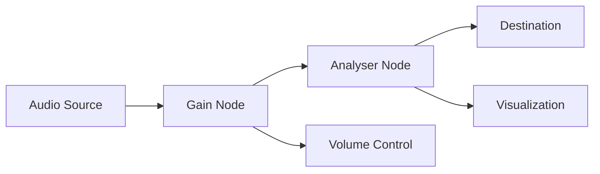

### ⚙️ Node Configuration

```typescript
// Analyzer configuration
analyzer.fftSize = 256
analyzer.smoothingTimeConstant = 0.8
analyzer.minDecibels = -90
analyzer.maxDecibels = -10

// Gain node configuration
gainNode.gain.value = volume
```

---

## ⚠️ Error Handling

### 🚫 Error Types

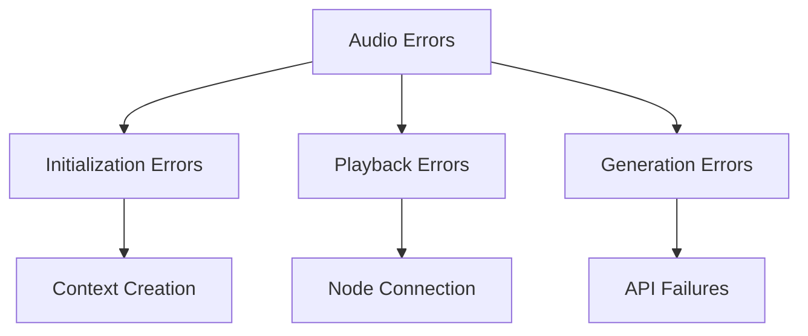

### 🔄 Error Recovery

```typescript
try {
  await manager.initialize()
} catch (error) {
  // Log error
  devLog('Failed to initialize AudioContext', {
    prefix: 'audio-context',
    level: 'error'
  }, { error })
  
  // Update state
  set(audioContextStateAtom, {
    ...get(audioContextStateAtom),
    error: error as Error
  })
  
  // Attempt recovery
  await retryInitialization()
}
```

---

## ⚡ Performance Considerations

### 🔋 Resource Management

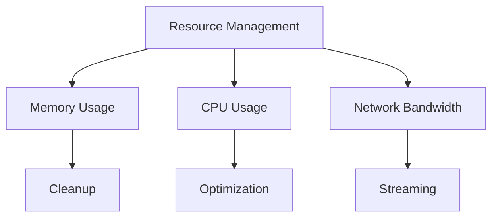

### 🚀 Optimization Techniques

- ✅ Lazy loading of audio context
- ✅ Efficient audio node cleanup
- ✅ Optimized analyzer settings
- ✅ Smart caching strategies

---

## 🔮 Future Improvements

### 🌟 Features

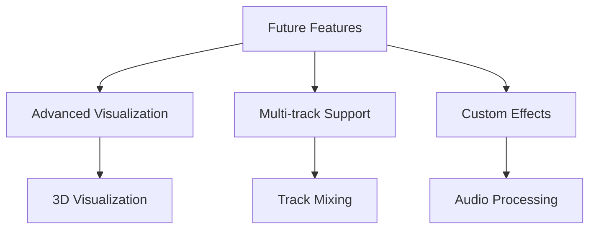

### 🔧 Technical Debt

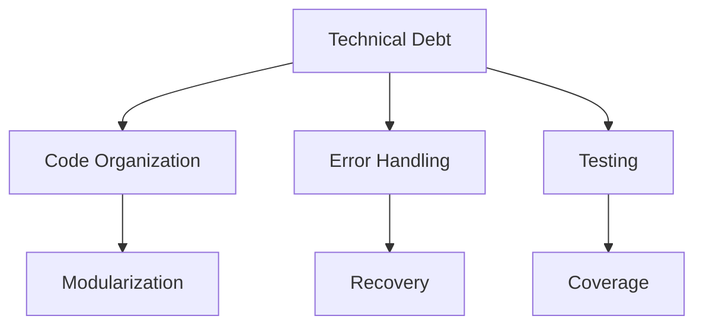

> 💡 **Pro Tip**: All color schemes in diagrams follow a consistent pattern:
> - 🔵 Components: Blue (#3B82F6)
> - 🟣 Services: Purple (#8B5CF6)
> - 🌸 Hooks: Pink (#EC4899)
> - 🟢 State: Green (#10B981)
> - 🟠 Storage: Orange (#F59E0B)
> - 🔴 Error: Red (#EF4444)
> - 🟢 Success: Green (#10B981) 