# Database Schema

> **Note**: This document details the application's database schema, including table structures, relationships, and data flow patterns.

## Overview

This document outlines the database schema and storage patterns used in the application, with a focus on audio data storage.

## Audio Data Storage

### Schema

```sql
-- Audio tracks table
CREATE TABLE audio_tracks (
  id UUID PRIMARY KEY DEFAULT uuid_generate_v4(),
  url TEXT NOT NULL,
  text TEXT NOT NULL,
  duration FLOAT NOT NULL,
  created_at TIMESTAMP WITH TIME ZONE DEFAULT NOW(),
  updated_at TIMESTAMP WITH TIME ZONE DEFAULT NOW(),
  metadata JSONB DEFAULT '{}'::jsonb,
  CONSTRAINT valid_duration CHECK (duration > 0),
  CONSTRAINT valid_url CHECK (url ~ '^https?://')
);

-- Audio alignments table
CREATE TABLE audio_alignments (
  id UUID PRIMARY KEY DEFAULT uuid_generate_v4(),
  track_id UUID REFERENCES audio_tracks(id) ON DELETE CASCADE,
  characters TEXT[] NOT NULL,
  start_times FLOAT[] NOT NULL,
  end_times FLOAT[] NOT NULL,
  created_at TIMESTAMP WITH TIME ZONE DEFAULT NOW(),
  updated_at TIMESTAMP WITH TIME ZONE DEFAULT NOW(),
  CONSTRAINT valid_alignment CHECK (
    array_length(characters, 1) = array_length(start_times, 1) AND
    array_length(characters, 1) = array_length(end_times, 1)
  ),
  CONSTRAINT valid_times CHECK (
    array_position(end_times, array_min(end_times)) >= array_position(start_times, array_min(start_times))
  )
);

-- Audio generation history
CREATE TABLE audio_generation_history (
  id UUID PRIMARY KEY DEFAULT uuid_generate_v4(),
  track_id UUID REFERENCES audio_tracks(id) ON DELETE CASCADE,
  voice_id TEXT NOT NULL,
  model_id TEXT NOT NULL,
  settings JSONB DEFAULT '{}'::jsonb,
  status TEXT NOT NULL,
  error TEXT,
  created_at TIMESTAMP WITH TIME ZONE DEFAULT NOW(),
  updated_at TIMESTAMP WITH TIME ZONE DEFAULT NOW(),
  CONSTRAINT valid_status CHECK (status IN ('pending', 'processing', 'completed', 'failed'))
);

-- Indexes for better query performance
CREATE INDEX idx_audio_tracks_created_at ON audio_tracks(created_at);
CREATE INDEX idx_audio_alignments_track_id ON audio_alignments(track_id);
CREATE INDEX idx_audio_generation_history_track_id ON audio_generation_history(track_id);
CREATE INDEX idx_audio_generation_history_status ON audio_generation_history(status);

-- Example data
INSERT INTO audio_tracks (url, text, duration, metadata)
VALUES (
    'https://storage.example.com/audio/123.mp3',
    'Hello, world!',
    2.5,
    '{"modelId": "eleven-multilingual-v2", "voiceId": "voice-123"}'
);

INSERT INTO audio_alignments (track_id, characters, start_times, end_times)
VALUES (
    '123e4567-e89b-12d3-a456-426614174000',
    ARRAY['H', 'e', 'l', 'l', 'o'],
    ARRAY[0.0, 0.1, 0.2, 0.3, 0.4],
    ARRAY[0.1, 0.2, 0.3, 0.4, 0.5]
);
```typescript
// Audio track model
interface AudioTrack {
  id: string
  url: string
  text: string
  duration: number
  createdAt: Date
  updatedAt: Date
  metadata: {
    modelId?: string
    voiceId?: string
    [key: string]: unknown
  }
}

// Audio alignment model
interface AudioAlignment {
  id: string
  trackId: string
  characters: string[]
  startTimes: number[]
  endTimes: number[]
  createdAt: Date
  updatedAt: Date
}

// Generation history model
interface AudioGenerationHistory {
  id: string
  trackId: string
  voiceId: string
  modelId: string
  settings: {
    stability?: number
    similarityBoost?: number
    style?: number
    useSpeakerBoost?: boolean
    [key: string]: unknown
  }
  status: 'pending' | 'completed' | 'failed'
  error?: string
  createdAt: Date
  updatedAt: Date
}
```

### Storage Architecture

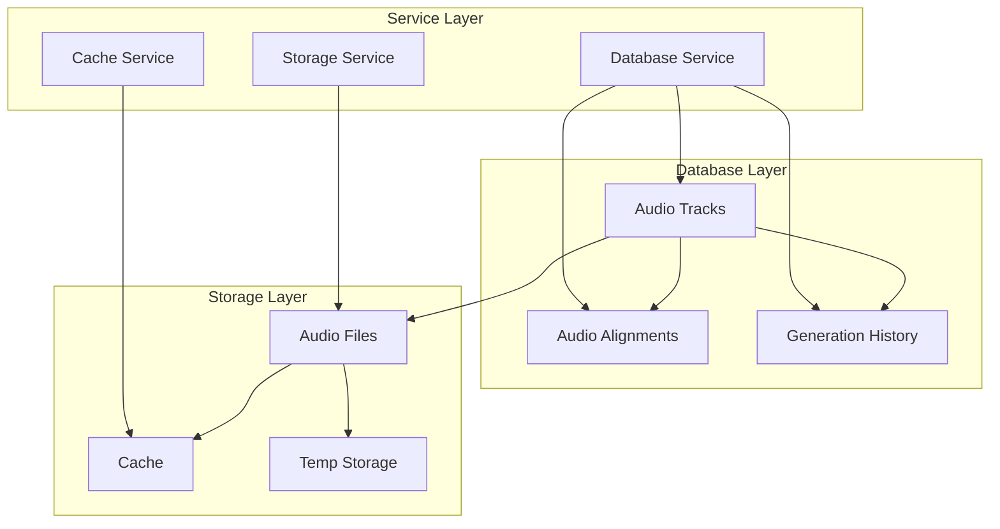

### Data Flow

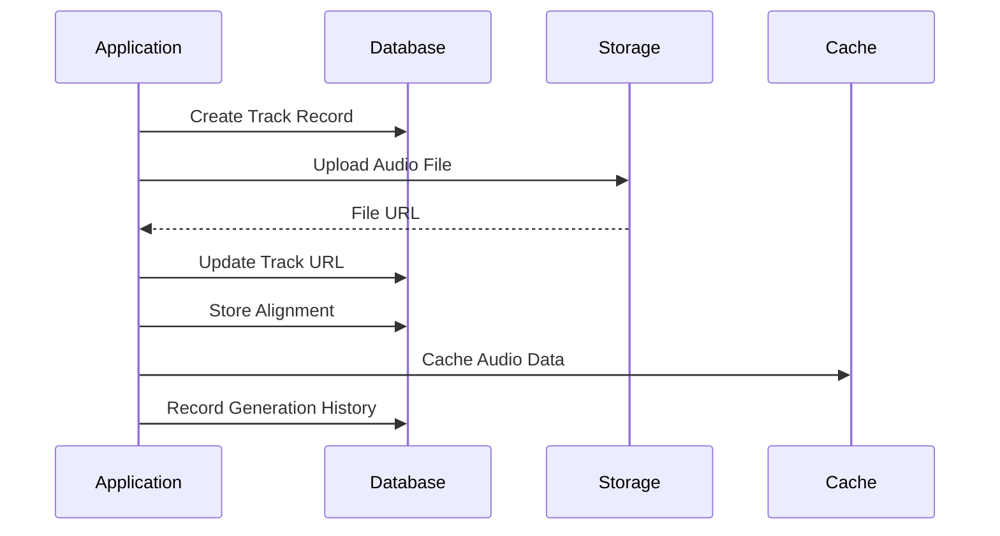

### Storage Service

```typescript
class StorageService {
  constructor(
    private supabase: SupabaseClient,
    private cache: CacheService
  ) {}

  async storeAudio(
    audioData: ArrayBuffer,
    metadata: AudioTrackMetadata
  ): Promise<AudioTrack> {
    // Upload to Supabase Storage
    const { data: fileData, error: uploadError } = await this.supabase.storage
      .from('audio')
      .upload(`${metadata.id}.mp3`, audioData)

    if (uploadError) throw new StorageError(uploadError.message)

    // Create database record
    const { data: track, error: dbError } = await this.supabase
      .from('audio_tracks')
      .insert({
        id: metadata.id,
        url: fileData.path,
        text: metadata.text,
        duration: metadata.duration,
        metadata: metadata
      })
      .select()
      .single()

    if (dbError) throw new DatabaseError(dbError.message)

    // Cache audio data
    await this.cache.set(`audio:${track.id}`, audioData)

    return track
  }

  async storeAlignment(
    trackId: string,
    alignment: AudioAlignment
  ): Promise<void> {
    const { error } = await this.supabase
      .from('audio_alignments')
      .insert({
        trackId,
        characters: alignment.characters,
        startTimes: alignment.startTimes,
        endTimes: alignment.endTimes
      })

    if (error) throw new DatabaseError(error.message)
  }
}
```

### Cache Management

```typescript
class CacheService {
  private cache: Map<string, unknown>
  private ttl: number

  constructor(ttl: number = 3600000) {
    this.cache = new Map()
    this.ttl = ttl
  }

  async get<T>(key: string): Promise<T | null> {
    const item = this.cache.get(key)
    if (!item) return null

    const { value, timestamp } = item as { value: T; timestamp: number }
    if (Date.now() - timestamp > this.ttl) {
      this.cache.delete(key)
      return null
    }

    return value
  }

  async set(key: string, value: unknown): Promise<void> {
    this.cache.set(key, {
      value,
      timestamp: Date.now()
    })
  }
}
```

### Error Handling

```typescript
class DatabaseError extends Error {
  constructor(message: string) {
    super(message)
    this.name = 'DatabaseError'
  }
}

class StorageError extends Error {
  constructor(message: string) {
    super(message)
    this.name = 'StorageError'
  }
}

async function handleStorageError(error: unknown): Promise<never> {
  if (error instanceof DatabaseError) {
    // Handle database errors
  } else if (error instanceof StorageError) {
    // Handle storage errors
  }
  throw error
}
```

### Testing

```typescript
describe('StorageService', () => {
  it('should store audio data', async () => {
    const service = new StorageService(mockSupabase, mockCache)
    const result = await service.storeAudio(
      new ArrayBuffer(0),
      mockMetadata
    )
    expect(result).toBeDefined()
    expect(result.url).toBeDefined()
  })

  it('should handle storage errors', async () => {
    const service = new StorageService(mockSupabase, mockCache)
    await expect(
      service.storeAudio(new ArrayBuffer(0), mockMetadata)
    ).rejects.toThrow(StorageError)
  })
})
```

## Schema Design

### 1. News History Table

```sql
CREATE TABLE news_history (
    id UUID PRIMARY KEY DEFAULT uuid_generate_v4(),
    headline TEXT NOT NULL,
    content TEXT NOT NULL,
    source_url TEXT,
    published_at TIMESTAMP WITH TIME ZONE DEFAULT NOW(),
    user_id UUID REFERENCES users(id),
    metadata JSONB DEFAULT '{}',
    created_at TIMESTAMP WITH TIME ZONE DEFAULT NOW(),
    updated_at TIMESTAMP WITH TIME ZONE DEFAULT NOW()
);

-- Indexes
CREATE INDEX idx_news_headline ON news_history USING gin (to_tsvector('english', headline));
CREATE INDEX idx_news_user_id ON news_history(user_id);
CREATE INDEX idx_news_created_at ON news_history(created_at);
```

### 2. Media Assets Table

```sql
CREATE TABLE media_assets (
    id UUID PRIMARY KEY DEFAULT uuid_generate_v4(),
    news_id UUID REFERENCES news_history(id),
    type TEXT NOT NULL CHECK (type IN ('image', 'audio')),
    url TEXT NOT NULL,
    metadata JSONB DEFAULT '{}',
    created_at TIMESTAMP WITH TIME ZONE DEFAULT NOW()
);

-- Indexes
CREATE INDEX idx_media_news_id ON media_assets(news_id);
CREATE INDEX idx_media_type ON media_assets(type);
```

### 3. Users Table

```sql
CREATE TABLE users (
    id UUID PRIMARY KEY DEFAULT uuid_generate_v4(),
    email TEXT UNIQUE NOT NULL,
    metadata JSONB DEFAULT '{}',
    created_at TIMESTAMP WITH TIME ZONE DEFAULT NOW(),
    updated_at TIMESTAMP WITH TIME ZONE DEFAULT NOW()
);

-- Indexes
CREATE INDEX idx_users_email ON users(email);
```

### 4. Subscriptions Table

```sql
CREATE TABLE subscriptions (
    id UUID PRIMARY KEY DEFAULT uuid_generate_v4(),
    user_id UUID REFERENCES users(id),
    plan TEXT NOT NULL CHECK (plan IN ('free', 'pro', 'enterprise')),
    status TEXT NOT NULL CHECK (status IN ('active', 'cancelled', 'expired')),
    start_date TIMESTAMP WITH TIME ZONE NOT NULL,
    end_date TIMESTAMP WITH TIME ZONE,
    metadata JSONB DEFAULT '{}',
    created_at TIMESTAMP WITH TIME ZONE DEFAULT NOW(),
    updated_at TIMESTAMP WITH TIME ZONE DEFAULT NOW()
);

-- Indexes
CREATE INDEX idx_subscriptions_user_id ON subscriptions(user_id);
CREATE INDEX idx_subscriptions_status ON subscriptions(status);
```

### 5. Usage Metrics Table

```sql
CREATE TABLE usage_metrics (
    id UUID PRIMARY KEY DEFAULT uuid_generate_v4(),
    user_id UUID REFERENCES users(id),
    news_id UUID REFERENCES news_history(id),
    subscription_id UUID REFERENCES subscriptions(id),
    action TEXT NOT NULL,
    metadata JSONB DEFAULT '{}',
    created_at TIMESTAMP WITH TIME ZONE DEFAULT NOW()
);

-- Indexes
CREATE INDEX idx_metrics_user_id ON usage_metrics(user_id);
CREATE INDEX idx_metrics_created_at ON usage_metrics(created_at);
```

## Data Flow

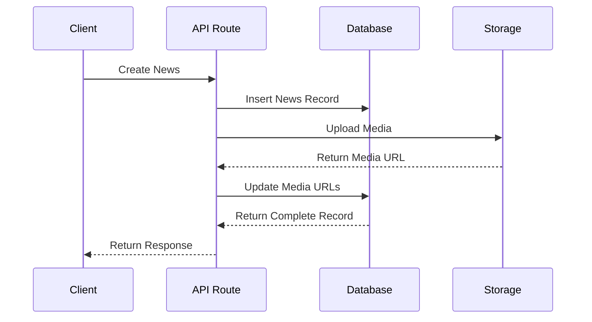

## Query Patterns

### 1. Latest News with Media

```sql
SELECT 
    n.id,
    n.headline,
    n.content,
    n.published_at,
    json_agg(
        json_build_object(
            'id', m.id,
            'type', m.type,
            'url', m.url
        )
    ) as media
FROM news_history n
LEFT JOIN media_assets m ON n.id = m.news_id
WHERE n.user_id = $1
GROUP BY n.id
ORDER BY n.created_at DESC
LIMIT 10;
```

### 2. User Usage Statistics

```sql
SELECT 
    u.email,
    COUNT(DISTINCT n.id) as total_news,
    COUNT(DISTINCT m.id) as total_media,
    s.plan as subscription_plan
FROM users u
LEFT JOIN news_history n ON u.id = n.user_id
LEFT JOIN media_assets m ON n.id = m.news_id
LEFT JOIN subscriptions s ON u.id = s.user_id
WHERE s.status = 'active'
GROUP BY u.id, u.email, s.plan;
```

## Data Integrity

### 1. Constraints

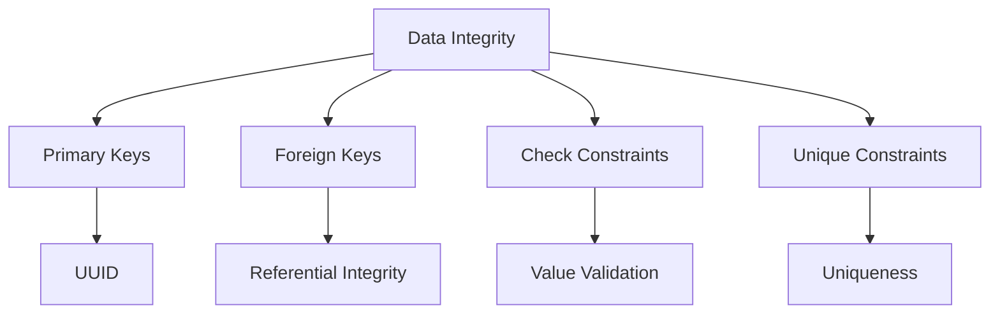

### 2. Triggers

```sql
-- Update Timestamp Trigger
CREATE OR REPLACE FUNCTION update_updated_at_column()
RETURNS TRIGGER AS $$
BEGIN
    NEW.updated_at = NOW();
    RETURN NEW;
END;
$$ language 'plpgsql';

CREATE TRIGGER update_news_updated_at
    BEFORE UPDATE ON news_history
    FOR EACH ROW
    EXECUTE FUNCTION update_updated_at_column();
```

## Performance Optimizations

### 1. Indexing Strategy

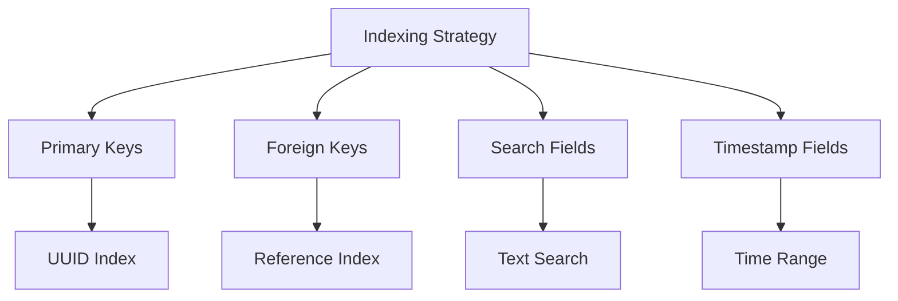

### 2. Partitioning

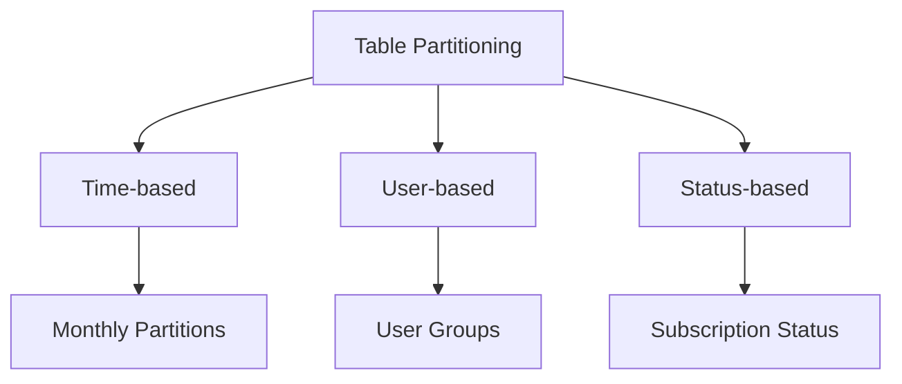

## Backup and Recovery

### 1. Backup Strategy

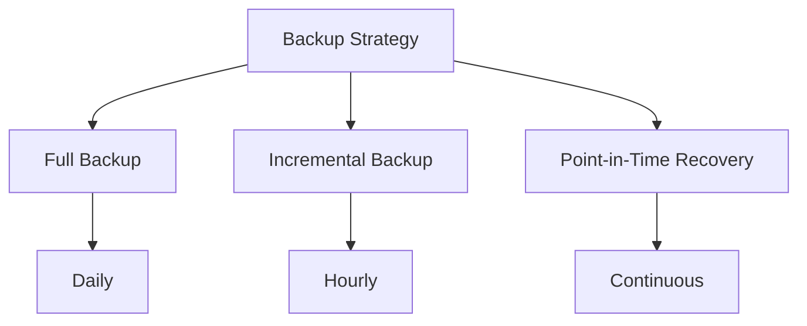

### 2. Recovery Process

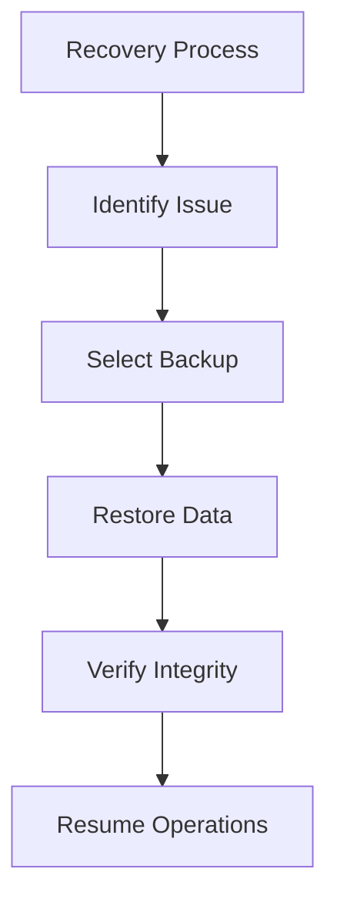

## Future Improvements

### 1. Scalability

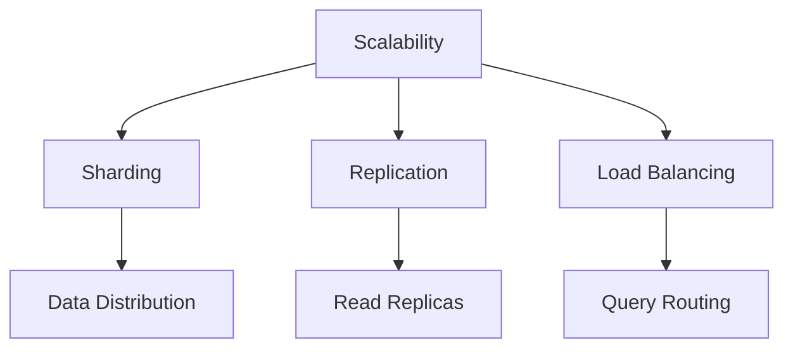

### 2. Performance

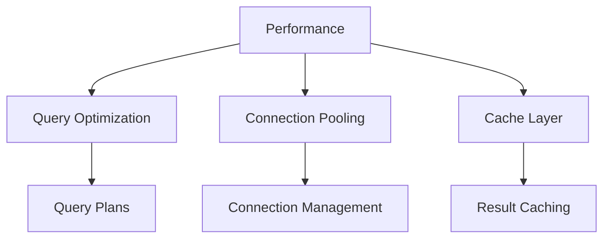

### 3. Monitoring

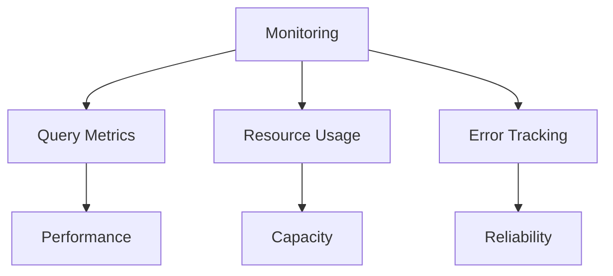

> **Note**: The color scheme used in the diagrams follows a consistent pattern:
> - Tables: Blue (#3B82F6)
> - Relationships: Purple (#8B5CF6)
> - Indexes: Green (#10B981)
> - Triggers: Orange (#F59E0B)
> - Constraints: Pink (#EC4899)
> - Performance: Yellow (#F59E0B)
> - Error: Red (#EF4444)
> - Success: Green (#10B981)

## 📚 Related Documentation

- [Audio Architecture](./audio-architecture.md) - Audio system architecture and components
- [API Integration](./api-integration.md) - External API integration details
- [State Management](./state-management.md) - State management patterns
- [Media Generation](./media-generation.md) - Media generation workflow

---

*Last updated: May 2023* 