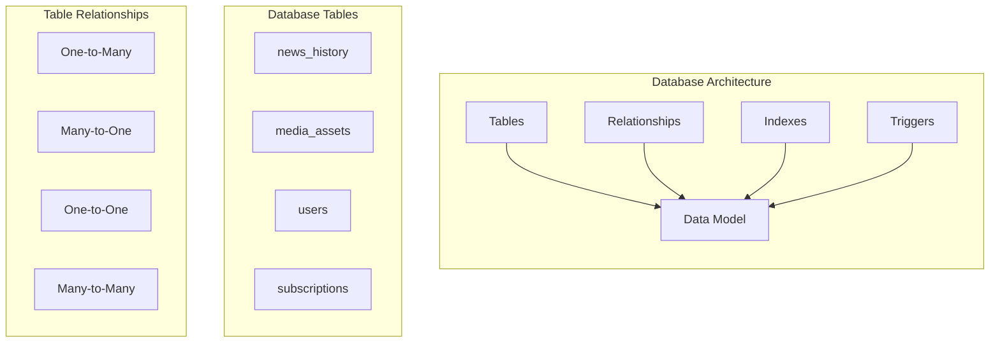
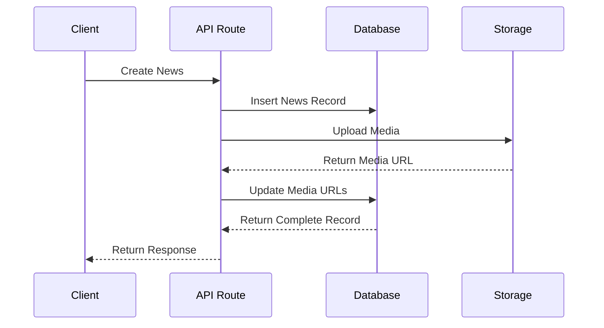
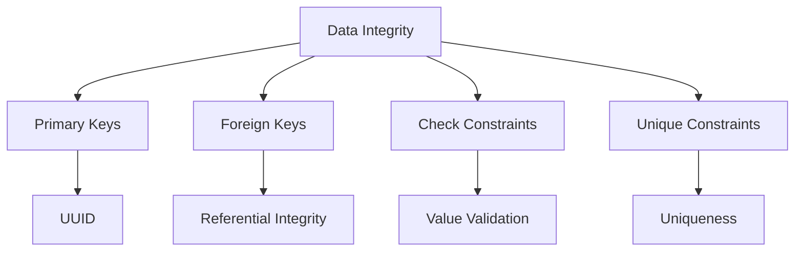
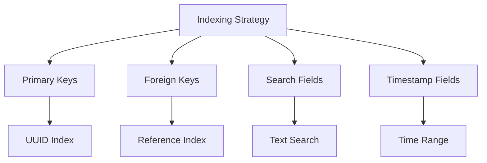
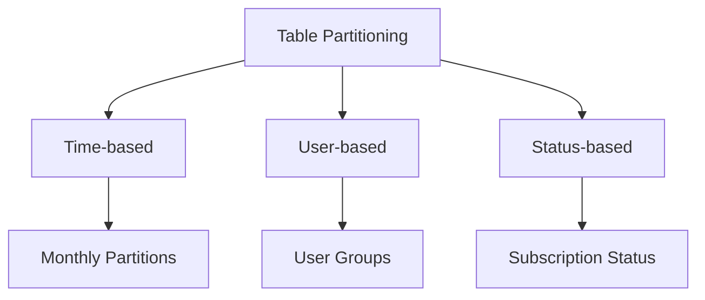
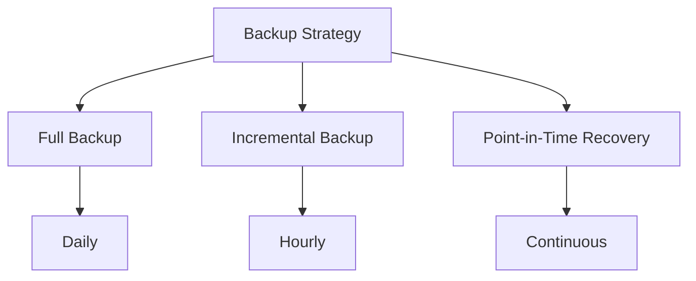
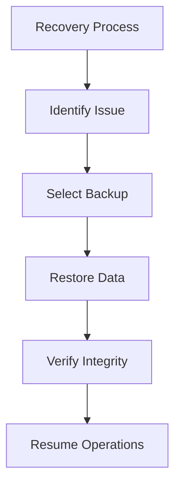
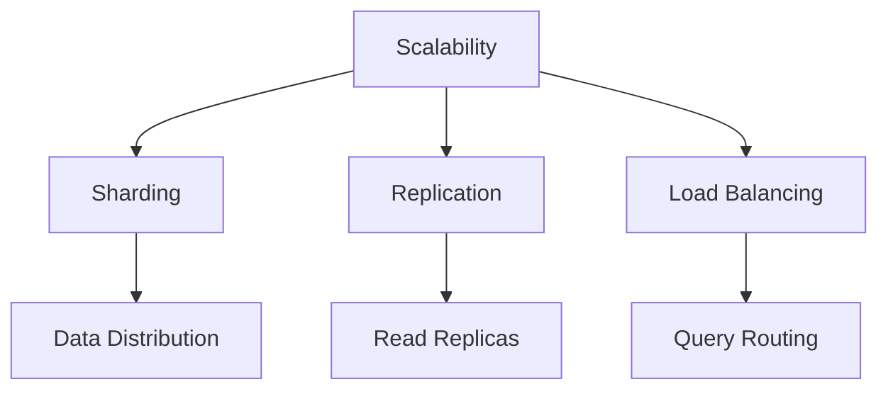
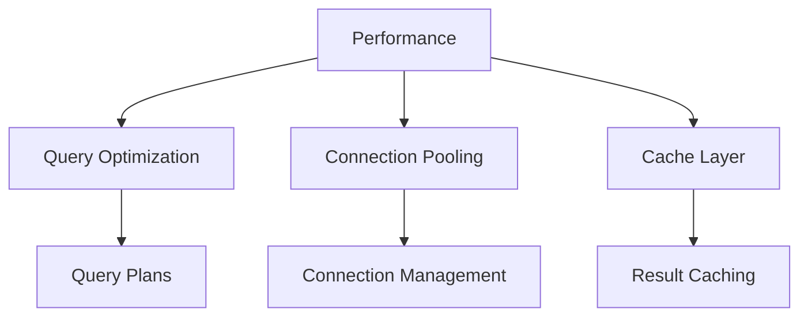
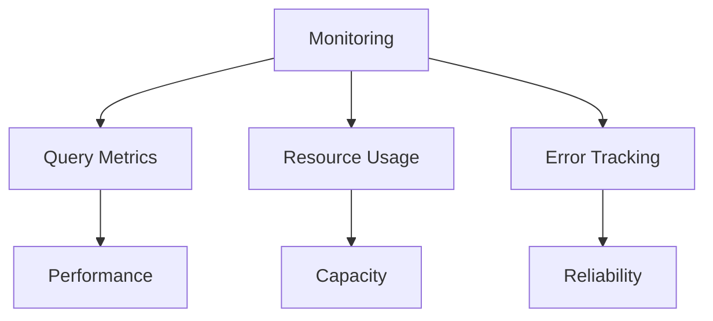

# Database Schema

> **Note**: This document details the application's database schema, including table structures, relationships, and data flow patterns.

## Overview



## Schema Design

### 1. News History Table

```sql
CREATE TABLE news_history (
    id UUID PRIMARY KEY DEFAULT uuid_generate_v4(),
    headline TEXT NOT NULL,
    content TEXT NOT NULL,
    source_url TEXT,
    published_at TIMESTAMP WITH TIME ZONE DEFAULT NOW(),
    user_id UUID REFERENCES users(id),
    metadata JSONB DEFAULT '{}',
    created_at TIMESTAMP WITH TIME ZONE DEFAULT NOW(),
    updated_at TIMESTAMP WITH TIME ZONE DEFAULT NOW()
);

-- Indexes
CREATE INDEX idx_news_headline ON news_history USING gin (to_tsvector('english', headline));
CREATE INDEX idx_news_user_id ON news_history(user_id);
CREATE INDEX idx_news_created_at ON news_history(created_at);
```

### 2. Media Assets Table

```sql
CREATE TABLE media_assets (
    id UUID PRIMARY KEY DEFAULT uuid_generate_v4(),
    news_id UUID REFERENCES news_history(id),
    type TEXT NOT NULL CHECK (type IN ('image', 'audio')),
    url TEXT NOT NULL,
    metadata JSONB DEFAULT '{}',
    created_at TIMESTAMP WITH TIME ZONE DEFAULT NOW()
);

-- Indexes
CREATE INDEX idx_media_news_id ON media_assets(news_id);
CREATE INDEX idx_media_type ON media_assets(type);
```

### 3. Users Table

```sql
CREATE TABLE users (
    id UUID PRIMARY KEY DEFAULT uuid_generate_v4(),
    email TEXT UNIQUE NOT NULL,
    metadata JSONB DEFAULT '{}',
    created_at TIMESTAMP WITH TIME ZONE DEFAULT NOW(),
    updated_at TIMESTAMP WITH TIME ZONE DEFAULT NOW()
);

-- Indexes
CREATE INDEX idx_users_email ON users(email);
```

### 4. Subscriptions Table

```sql
CREATE TABLE subscriptions (
    id UUID PRIMARY KEY DEFAULT uuid_generate_v4(),
    user_id UUID REFERENCES users(id),
    plan TEXT NOT NULL CHECK (plan IN ('free', 'pro', 'enterprise')),
    status TEXT NOT NULL CHECK (status IN ('active', 'cancelled', 'expired')),
    start_date TIMESTAMP WITH TIME ZONE NOT NULL,
    end_date TIMESTAMP WITH TIME ZONE,
    metadata JSONB DEFAULT '{}',
    created_at TIMESTAMP WITH TIME ZONE DEFAULT NOW(),
    updated_at TIMESTAMP WITH TIME ZONE DEFAULT NOW()
);

-- Indexes
CREATE INDEX idx_subscriptions_user_id ON subscriptions(user_id);
CREATE INDEX idx_subscriptions_status ON subscriptions(status);
```

### 5. Usage Metrics Table

```sql
CREATE TABLE usage_metrics (
    id UUID PRIMARY KEY DEFAULT uuid_generate_v4(),
    user_id UUID REFERENCES users(id),
    news_id UUID REFERENCES news_history(id),
    subscription_id UUID REFERENCES subscriptions(id),
    action TEXT NOT NULL,
    metadata JSONB DEFAULT '{}',
    created_at TIMESTAMP WITH TIME ZONE DEFAULT NOW()
);

-- Indexes
CREATE INDEX idx_metrics_user_id ON usage_metrics(user_id);
CREATE INDEX idx_metrics_created_at ON usage_metrics(created_at);
```

## Data Flow



## Query Patterns

### 1. Latest News with Media

```sql
SELECT 
    n.id,
    n.headline,
    n.content,
    n.published_at,
    json_agg(
        json_build_object(
            'id', m.id,
            'type', m.type,
            'url', m.url
        )
    ) as media
FROM news_history n
LEFT JOIN media_assets m ON n.id = m.news_id
WHERE n.user_id = $1
GROUP BY n.id
ORDER BY n.created_at DESC
LIMIT 10;
```

### 2. User Usage Statistics

```sql
SELECT 
    u.email,
    COUNT(DISTINCT n.id) as total_news,
    COUNT(DISTINCT m.id) as total_media,
    s.plan as subscription_plan
FROM users u
LEFT JOIN news_history n ON u.id = n.user_id
LEFT JOIN media_assets m ON n.id = m.news_id
LEFT JOIN subscriptions s ON u.id = s.user_id
WHERE s.status = 'active'
GROUP BY u.id, u.email, s.plan;
```

## Data Integrity

### 1. Constraints



### 2. Triggers

```sql
-- Update Timestamp Trigger
CREATE OR REPLACE FUNCTION update_updated_at_column()
RETURNS TRIGGER AS $$
BEGIN
    NEW.updated_at = NOW();
    RETURN NEW;
END;
$$ language 'plpgsql';

CREATE TRIGGER update_news_updated_at
    BEFORE UPDATE ON news_history
    FOR EACH ROW
    EXECUTE FUNCTION update_updated_at_column();
```

## Performance Optimizations

### 1. Indexing Strategy



### 2. Partitioning



## Backup and Recovery

### 1. Backup Strategy



### 2. Recovery Process



## Future Improvements

### 1. Scalability



### 2. Performance



### 3. Monitoring



> **Note**: The color scheme used in the diagrams follows a consistent pattern:
> - Tables: Blue (#3B82F6)
> - Relationships: Purple (#8B5CF6)
> - Indexes: Green (#10B981)
> - Triggers: Orange (#F59E0B)
> - Constraints: Pink (#EC4899)
> - Performance: Yellow (#F59E0B)
> - Error: Red (#EF4444)
> - Success: Green (#10B981) 