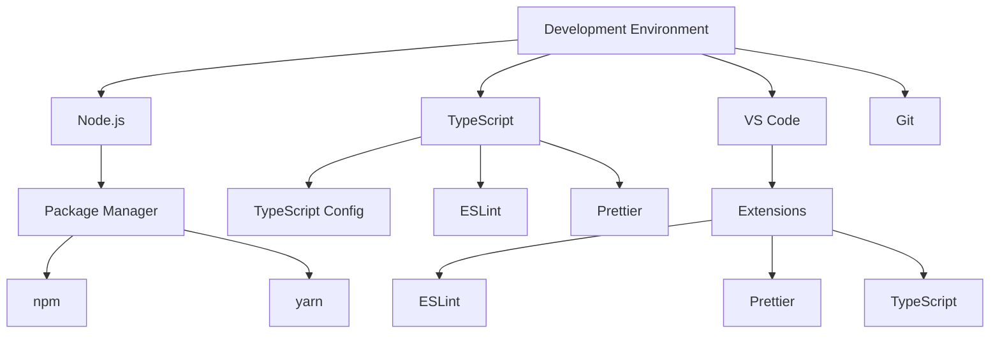
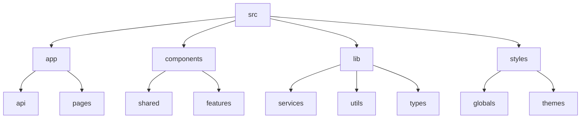
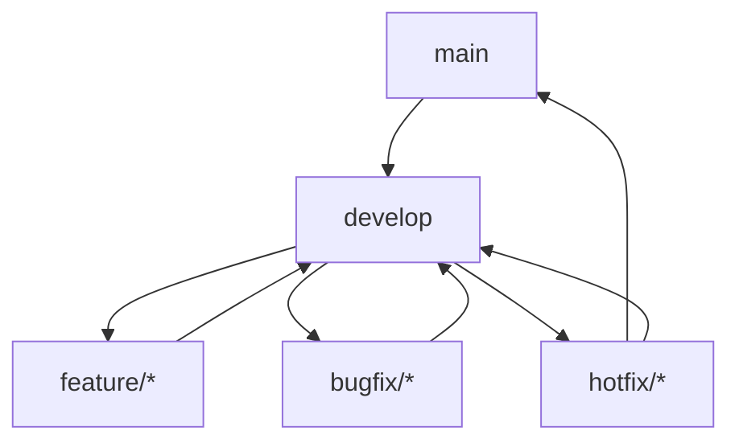

# Development Guide

## Overview

This document outlines the development workflow, coding standards, and best practices for the AI24 News Generator project.

## Development Environment



## Setup Instructions

### 1. Prerequisites

```bash
# Required versions
node >= 18.0.0
npm >= 9.0.0
git >= 2.0.0

# Install dependencies
npm install

# Set up environment variables
cp .env.example .env.local
```

### 2. Development Server

```bash
# Start development server
npm run dev

# Build for production
npm run build

# Start production server
npm start
```

## Code Organization



## Coding Standards

### 1. TypeScript

```typescript
// Use interfaces for object shapes
interface User {
  id: string;
  email: string;
  name?: string;
}

// Use type for unions and intersections
type Status = 'active' | 'inactive' | 'pending';
type ExtendedUser = User & { role: string };

// Use enums for constants
enum UserRole {
  ADMIN = 'admin',
  USER = 'user',
  GUEST = 'guest'
}
```

### 2. React Components

```typescript
// Functional Components
const UserCard: React.FC<UserCardProps> = ({ user, onEdit }) => {
  return (
    <div className="card">
      <h3>{user.name}</h3>
      <p>{user.email}</p>
      <button onClick={() => onEdit(user)}>Edit</button>
    </div>
  );
};

// Custom Hooks
const useUserData = (userId: string) => {
  const [user, setUser] = useState<User | null>(null);
  const [loading, setLoading] = useState(true);
  const [error, setError] = useState<Error | null>(null);

  useEffect(() => {
    fetchUserData(userId)
      .then(setUser)
      .catch(setError)
      .finally(() => setLoading(false));
  }, [userId]);

  return { user, loading, error };
};
```

### 3. Styling

```typescript
// Tailwind Classes
const buttonClasses = `
  px-4 py-2
  rounded-lg
  font-medium
  transition-colors
  ${variant === 'primary' ? 'bg-blue-500 text-white' : 'bg-gray-200'}
`;

// CSS Modules
import styles from './Button.module.css';

const Button = ({ children, variant }: ButtonProps) => (
  <button className={`${styles.button} ${styles[variant]}`}>
    {children}
  </button>
);
```

## Testing

### 1. Unit Tests

```typescript
// Component Test
describe('UserCard', () => {
  it('renders user information', () => {
    const user = {
      id: '1',
      name: 'John Doe',
      email: 'john@example.com'
    };
    
    render(<UserCard user={user} onEdit={jest.fn()} />);
    
    expect(screen.getByText(user.name)).toBeInTheDocument();
    expect(screen.getByText(user.email)).toBeInTheDocument();
  });
});

// Hook Test
describe('useUserData', () => {
  it('fetches user data', async () => {
    const { result } = renderHook(() => useUserData('1'));
    
    expect(result.current.loading).toBe(true);
    
    await waitFor(() => {
      expect(result.current.loading).toBe(false);
      expect(result.current.user).toBeDefined();
    });
  });
});
```

### 2. Integration Tests

```typescript
// API Integration Test
describe('User API', () => {
  it('creates a new user', async () => {
    const userData = {
      name: 'Jane Doe',
      email: 'jane@example.com'
    };
    
    const response = await fetch('/api/users', {
      method: 'POST',
      headers: { 'Content-Type': 'application/json' },
      body: JSON.stringify(userData)
    });
    
    expect(response.status).toBe(201);
    const user = await response.json();
    expect(user.name).toBe(userData.name);
  });
});
```

## Git Workflow

### 1. Branch Strategy



### 2. Commit Messages

```bash
# Format
<type>(<scope>): <description>

# Examples
feat(auth): add social login
fix(api): handle rate limiting
docs(readme): update setup instructions
```

## Performance Optimization

### 1. Code Splitting

```typescript
// Dynamic Imports
const UserProfile = dynamic(() => import('./UserProfile'), {
  loading: () => <LoadingSpinner />,
  ssr: false
});

// Route-based Code Splitting
const routes = {
  '/': lazy(() => import('./pages/Home')),
  '/profile': lazy(() => import('./pages/Profile')),
  '/settings': lazy(() => import('./pages/Settings'))
};
```

### 2. Image Optimization

```typescript
// Next.js Image Component
import Image from 'next/image';

const OptimizedImage = ({ src, alt }: ImageProps) => (
  <Image
    src={src}
    alt={alt}
    width={800}
    height={600}
    quality={75}
    placeholder="blur"
    blurDataURL="data:image/jpeg;base64,..."
  />
);
```

## Deployment

### 1. Build Process

```bash
# Build
npm run build

# Analyze Bundle
npm run analyze

# Test Production Build
npm run start
```

### 2. Environment Variables

```bash
# Development
NEXT_PUBLIC_API_URL=http://localhost:3000
NEXT_PUBLIC_SUPABASE_URL=your_supabase_url

# Production
NEXT_PUBLIC_API_URL=https://api.example.com
NEXT_PUBLIC_SUPABASE_URL=your_production_supabase_url
```

## Monitoring and Debugging

### 1. Error Tracking

```typescript
// Error Boundary
class ErrorBoundary extends React.Component {
  componentDidCatch(error: Error, errorInfo: React.ErrorInfo) {
    // Log to error tracking service
    logError(error, errorInfo);
  }

  render() {
    return this.props.children;
  }
}

// Error Logging
const logError = (error: Error, context?: any) => {
  console.error(error);
  // Send to error tracking service
  errorTrackingService.capture(error, context);
};
```

### 2. Performance Monitoring

```typescript
// Performance Metrics
const measurePerformance = (name: string) => {
  const start = performance.now();
  return () => {
    const duration = performance.now() - start;
    console.log(`${name} took ${duration}ms`);
    // Send to analytics service
    analyticsService.trackMetric(name, duration);
  };
};
```

## Future Improvements

### 1. Development Experience

- Automated testing setup
- Development containers
- Code generation tools
- Documentation automation

### 2. Build Process

- Faster builds
- Smaller bundles
- Better caching
- CI/CD improvements

### 3. Quality Assurance

- Automated accessibility testing
- Visual regression testing
- Performance benchmarking
- Security scanning 

## ❓ Frequently Asked Questions

<details>
<summary><strong>Why isn't my audio playing in Safari?</strong></summary>

Safari has stricter autoplay policies. To fix this:

1. Ensure audio playback is initiated by a user action (click, tap)
2. Set `<audio>` element with `playsInline muted` attributes initially
3. Add proper CORS headers to audio files
4. Check Safari console for specific errors

```typescript
// Example fix
const startAudio = () => {
  const audio = new Audio(url);
  audio.playsInline = true;
  audio.muted = true; // Start muted
  
  // Unmute after user interaction
  userInteractionPromise.then(() => {
    audio.muted = false;
  });
  
  return audio;
};
```
</details>

<details>
<summary><strong>How do I fix alignment data issues?</strong></summary>

If you're experiencing misalignment between audio and highlighted text:

1. Verify alignment data format matches expected schema
2. Check for empty or null values in character arrays
3. Ensure start times are always <= end times
4. Validate total duration matches audio file length

```typescript
// Validation helper
const validateAlignment = (alignment) => {
  if (!alignment?.characters?.length) return false;
  
  // Check for invalid times
  return alignment.characters.every((char, i) => {
    const start = alignment.character_start_times_seconds[i];
    const end = alignment.character_end_times_seconds[i];
    return start <= end;
  });
};
```
</details>

<details>
<summary><strong>What's the best way to debug audio visualization issues?</strong></summary>

For audio visualization problems:

1. Check browser console for Web Audio API errors
2. Verify `AudioContext` is properly initialized after user interaction
3. Inspect analyzer node configuration (FFT size, smoothing)
4. Use `console.log()` to output frequency data

```typescript
// Debug helper
const debugAnalyzer = (analyzerNode, dataArray) => {
  console.log('Analyzer FFT size:', analyzerNode.fftSize);
  console.log('Data array sample:', dataArray.slice(0, 5));
  
  // Check if data is changing
  setInterval(() => {
    analyzerNode.getByteFrequencyData(dataArray);
    console.log('Peak frequency:', Math.max(...Array.from(dataArray)));
  }, 1000);
};
```
</details>

<details>
<summary><strong>How do I handle ElevenLabs API rate limits?</strong></summary>

To handle API rate limiting:

1. Implement exponential backoff for retries
2. Add request queuing for high-volume scenarios
3. Cache generated audio when possible
4. Monitor usage with Supabase analytics

```typescript
// Example backoff implementation
const withBackoff = async (fn, maxRetries = 3) => {
  let retries = 0;
  
  while (retries < maxRetries) {
    try {
      return await fn();
    } catch (error) {
      if (error.status === 429) {
        const delay = Math.pow(2, retries) * 1000;
        console.log(`Rate limited. Retrying in ${delay}ms`);
        await new Promise(resolve => setTimeout(resolve, delay));
        retries++;
      } else {
        throw error;
      }
    }
  }
  
  throw new Error('Max retries exceeded');
};
```
</details>

--- 