# Media Generation Flow

> **Note**: This document details the media generation process, including image and audio generation, storage, and delivery.

## Overview

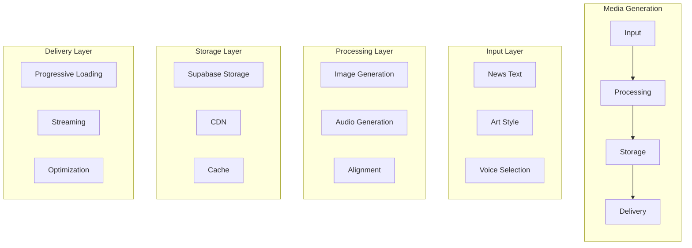

## Process Flow

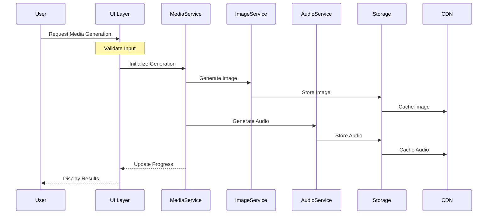

## Service Architecture

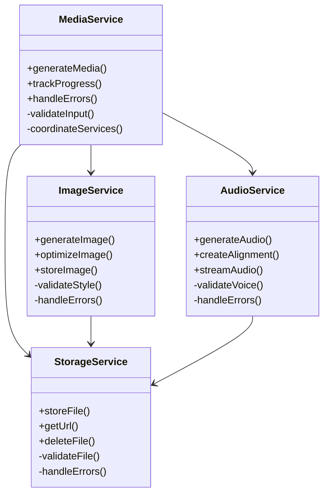

## Progress Tracking

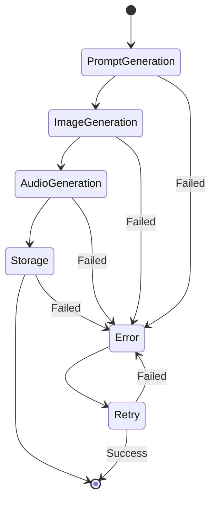

## Technical Implementation

### 1. Media Service

```typescript
interface MediaGenerationConfig {
  headline: string;
  artStyle: ArtStyle;
  voiceId?: string;
  onProgress?: (status: GenerationStatus) => void;
}

interface GenerationStatus {
  stage: 'prompt' | 'image' | 'audio' | 'storage';
  progress: number;
  error?: string;
  data?: any;
}
```

### 2. Prompt Generation

```typescript
interface PromptConfig {
  headline: string;
  style: ArtStyle;
  constraints: {
    maxLength: number;
    styleGuidelines: string[];
  };
}

interface PromptResult {
  prompt: string;
  metadata: {
    style: ArtStyle;
    timestamp: string;
    version: string;
  };
}
```

### 3. Image Generation

```typescript
interface ImageConfig {
  prompt: string;
  style: ArtStyle;
  resolution: {
    width: number;
    height: number;
  };
  format: 'webp' | 'png' | 'jpg';
}

interface ImageResult {
  url: string;
  metadata: {
    size: number;
    format: string;
    dimensions: {
      width: number;
      height: number;
    };
  };
}
```

### 4. Audio Generation

```typescript
interface AudioConfig {
  text: string;
  voiceId: string;
  format: 'mp3' | 'wav';
  quality: 'low' | 'medium' | 'high';
}

interface AudioResult {
  url: string;
  alignment: AudioAlignment;
  metadata: {
    duration: number;
    format: string;
    quality: string;
  };
}
```

## Error Handling

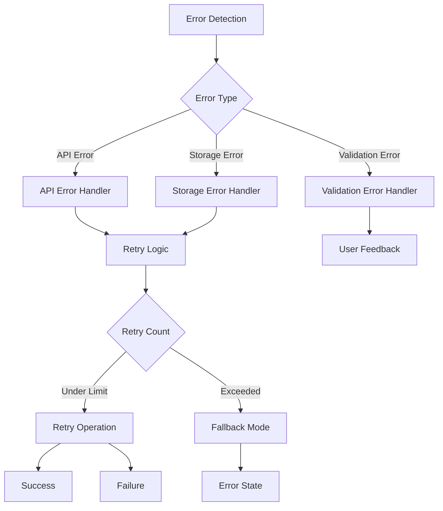

## Performance Considerations

### 1. Resource Management

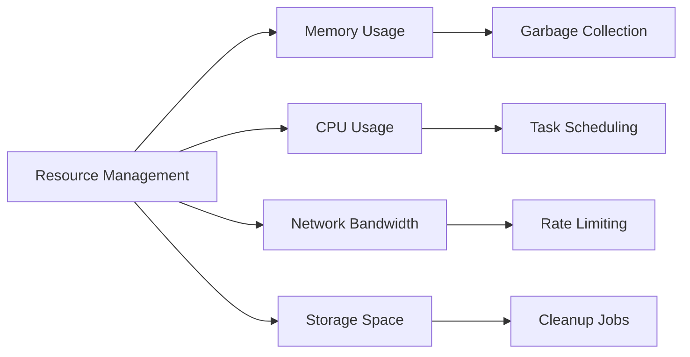

### 2. Caching Strategy

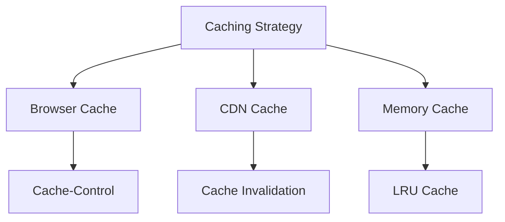

### 3. Monitoring

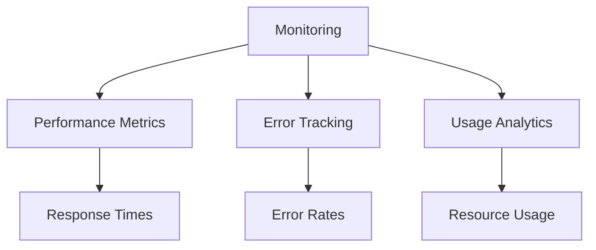

## Security Measures

### 1. Input Validation

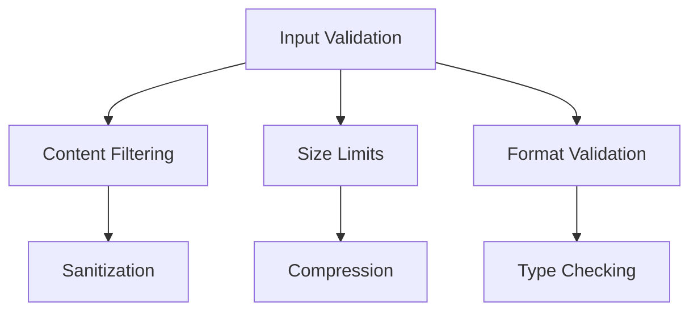

### 2. API Security

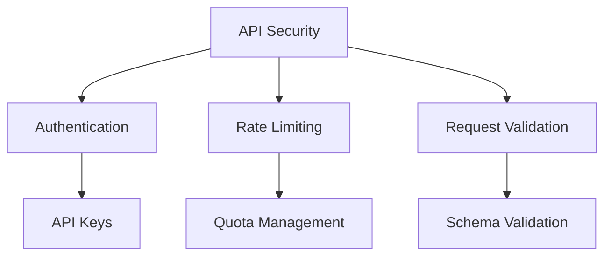

### 3. Storage Security

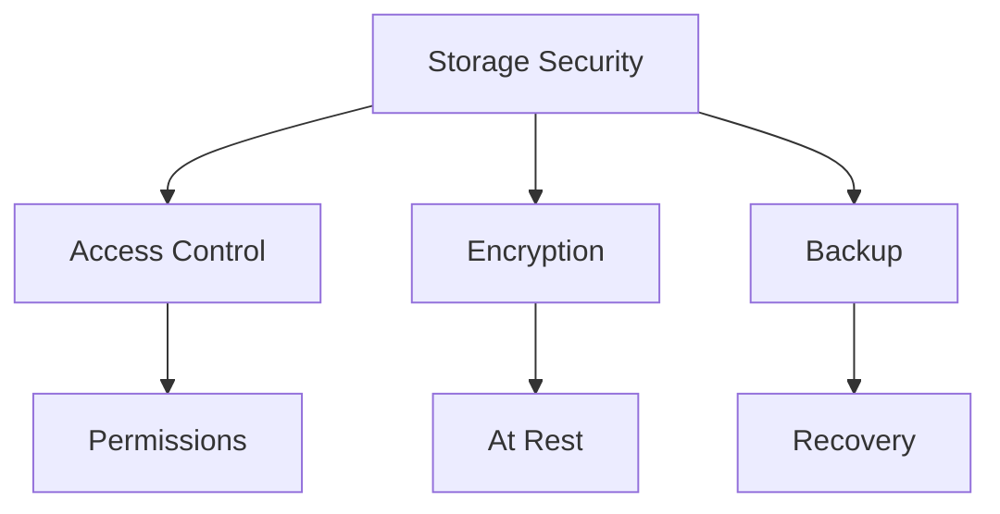

## Future Enhancements

### 1. Scalability

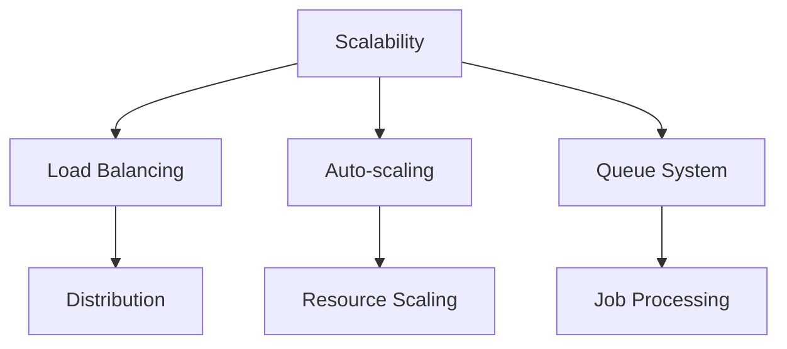

### 2. Features

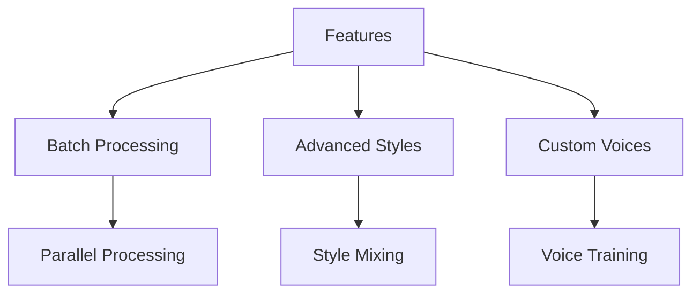

### 3. Optimization

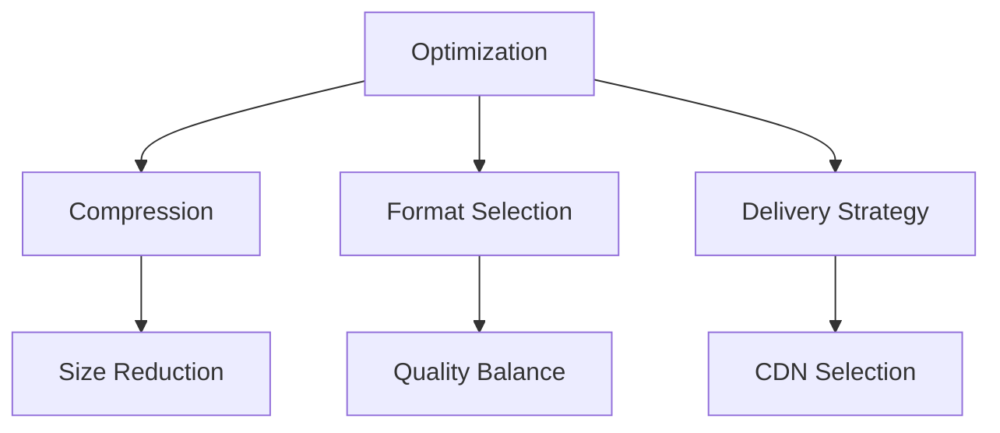

> **Note**: The color scheme used in the diagrams follows a consistent pattern:
> - Input: Blue (#3B82F6)
> - Processing: Purple (#8B5CF6)
> - Storage: Green (#10B981)
> - Delivery: Orange (#F59E0B)
> - Error: Red (#EF4444)
> - Success: Green (#10B981)
> - Warning: Yellow (#F59E0B)
> - Info: Blue (#3B82F6) 