# Media Generation Flow

> **Note**: This document details the media generation process, including image and audio generation, storage, and delivery.

## Overview

The application supports various types of media generation, including audio, images, and video. This document focuses on the audio generation system, particularly the integration with ElevenLabs for text-to-speech generation.

## Audio Generation System

### Architecture

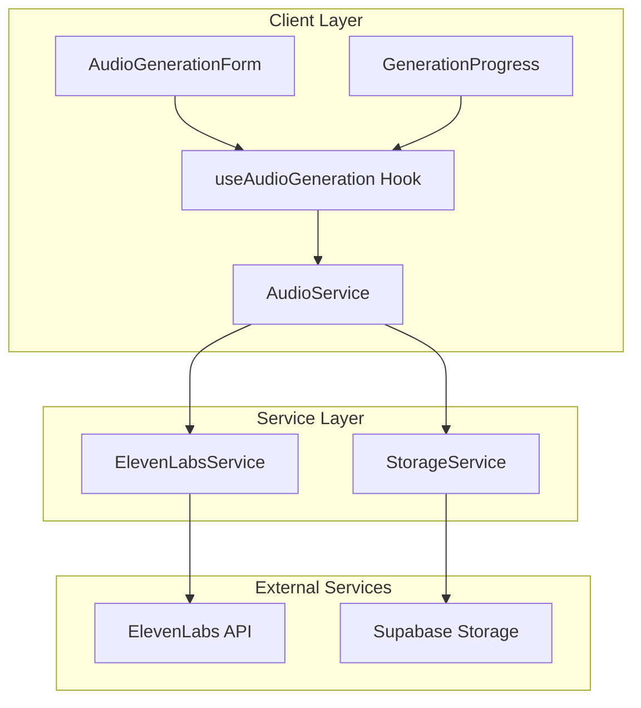

### Core Components

#### 1. Audio Generation Hook

```typescript
interface AudioGenerationOptions {
  text: string
  voiceId: string
  modelId: string
  stability?: number
  similarityBoost?: number
  style?: number
  useSpeakerBoost?: boolean
}

interface AudioGenerationResult {
  audioUrl: string
  alignment: AudioAlignment
  duration: number
  metadata: {
    modelId: string
    voiceId: string
    timestamp: string
  }
}
```

#### 2. ElevenLabs Service

```typescript
class ElevenLabsService {
  private apiKey: string
  private baseUrl: string

  constructor(apiKey: string) {
    this.apiKey = apiKey
    this.baseUrl = 'https://api.elevenlabs.io/v1'
  }

  async generateSpeech(options: AudioGenerationOptions): Promise<{
    audioData: ArrayBuffer
    alignment: RawAudioAlignment
  }> {
    // Implementation details
  }
}
```

#### 3. Audio Service

```typescript
class AudioService {
  constructor(
    private elevenLabs: ElevenLabsService,
    private storage: StorageService
  ) {}

  async generateAudio(options: AudioGenerationOptions): Promise<AudioGenerationResult> {
    // Implementation details
  }
}
```

### Generation Flow

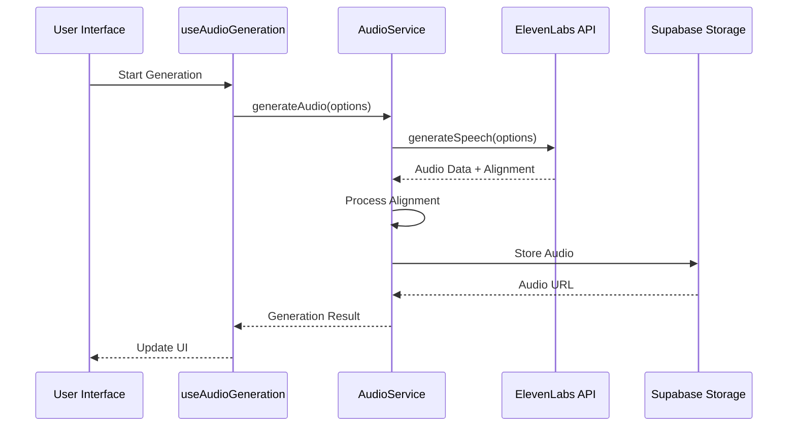

### Alignment Processing

The audio generation process includes character-level alignment:

> ⚠️ **IMPORTANT**: The alignment data is critical for synchronized text highlighting and must be properly stored and processed.

1. **Raw Alignment** (from ElevenLabs):
```typescript
{
  characters: [
    { char: "H", start: 0.0, end: 0.1 },
    { char: "e", start: 0.1, end: 0.2 }
  ]
}
```

2. **Normalized Alignment**:
```typescript
{
  characters: ["H", "e"],
  character_start_times_seconds: [0.0, 0.1],
  character_end_times_seconds: [0.1, 0.2]
}
```

> 📝 **Note**: Our application always transforms between these formats automatically, so you don't need to handle conversion manually.

### Error Handling

```typescript
try {
  const result = await generateAudio(options)
  return result
} catch (error) {
  if (error instanceof ElevenLabsError) {
    // Handle API-specific errors
  } else if (error instanceof StorageError) {
    // Handle storage errors
  } else {
    // Handle general errors
  }
  throw error
}
```

### Progress Tracking

Generation progress is tracked through a callback system:

```typescript
interface GenerationProgress {
  status: 'idle' | 'generating' | 'processing' | 'complete' | 'error'
  progress: number
  message: string
  error?: Error
}

const [progress, setProgress] = useState<GenerationProgress>({
  status: 'idle',
  progress: 0,
  message: ''
})
```

### Storage Management

Generated audio is stored in Supabase with the following structure:

```typescript
interface StoredAudio {
  id: string
  url: string
  alignment: AudioAlignment
  metadata: {
    modelId: string
    voiceId: string
    timestamp: string
  }
}
```

### Usage Example

```typescript
const { generateAudio, progress } = useAudioGeneration()

const handleGenerate = async () => {
  try {
    const result = await generateAudio({
      text: "Hello, world!",
      voiceId: "voice-id",
      modelId: "model-id"
    })
    
    // Handle successful generation
  } catch (error) {
    // Handle error
  }
}
```

## Process Flow

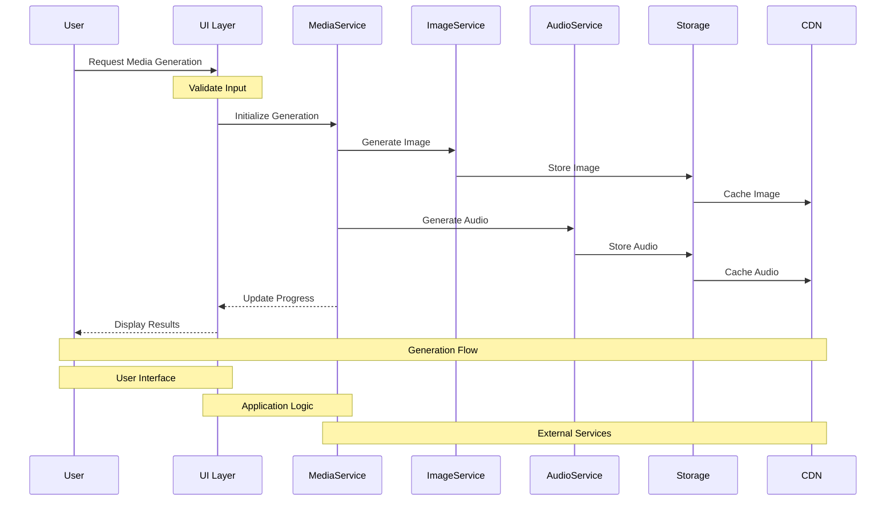

## Service Architecture

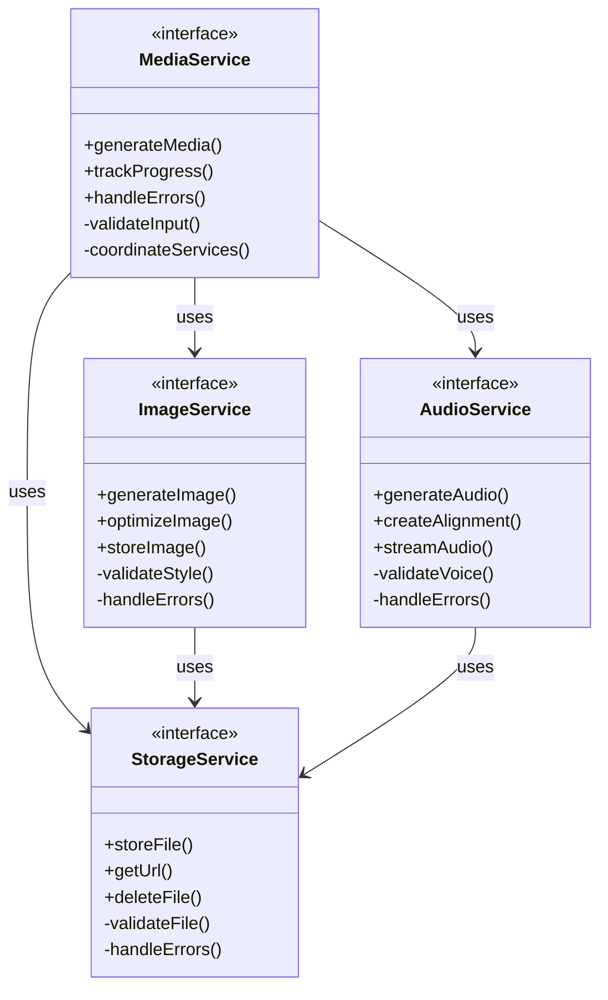

## Progress Tracking

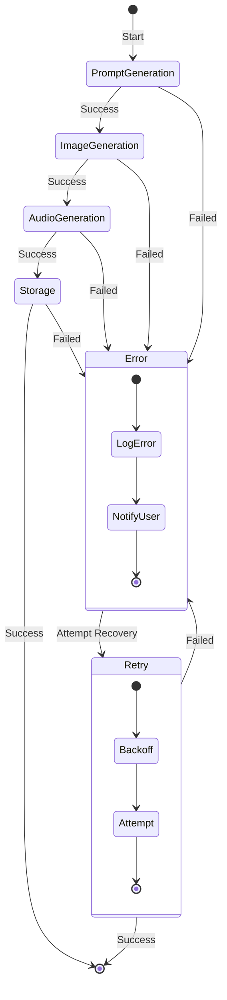

## Technical Implementation

### 1. Media Service

```typescript
interface MediaGenerationConfig {
  headline: string;
  artStyle: ArtStyle;
  voiceId?: string;
  onProgress?: (status: GenerationStatus) => void;
}

interface GenerationStatus {
  stage: 'prompt' | 'image' | 'audio' | 'storage';
  progress: number;
  error?: string;
  data?: any;
}
```

### 2. Prompt Generation

```typescript
interface PromptConfig {
  headline: string;
  style: ArtStyle;
  constraints: {
    maxLength: number;
    styleGuidelines: string[];
  };
}

interface PromptResult {
  prompt: string;
  metadata: {
    style: ArtStyle;
    timestamp: string;
    version: string;
  };
}
```

### 3. Image Generation

```typescript
interface ImageConfig {
  prompt: string;
  style: ArtStyle;
  resolution: {
    width: number;
    height: number;
  };
  format: 'webp' | 'png' | 'jpg';
}

interface ImageResult {
  url: string;
  metadata: {
    size: number;
    format: string;
    dimensions: {
      width: number;
      height: number;
    };
  };
}
```

### 4. Audio Generation

```typescript
interface AudioConfig {
  text: string;
  voiceId: string;
  format: 'mp3' | 'wav';
  quality: 'low' | 'medium' | 'high';
}

interface AudioResult {
  url: string;
  alignment: AudioAlignment;
  metadata: {
    duration: number;
    format: string;
    quality: string;
  };
}
```

## Error Handling

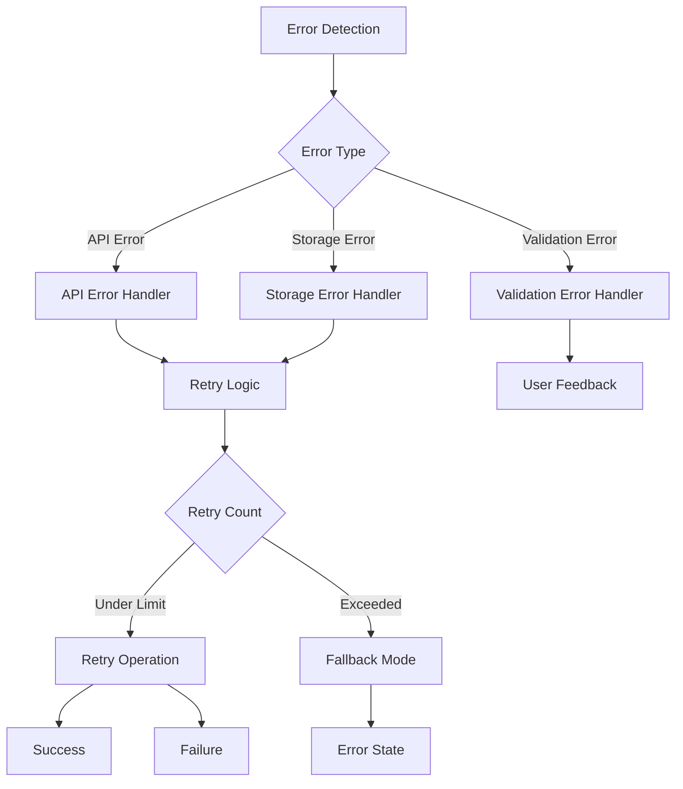

## Performance Considerations

### 1. Resource Management

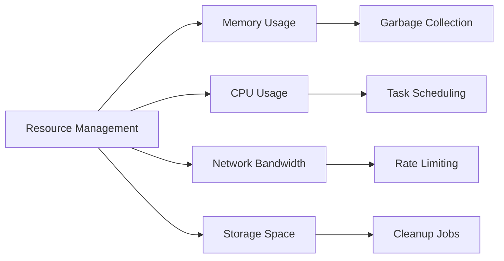

### 2. Caching Strategy

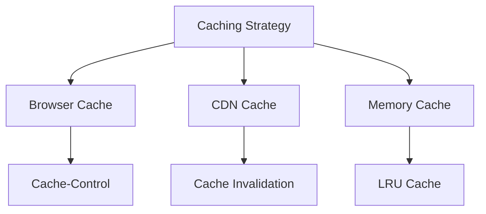

### 3. Monitoring

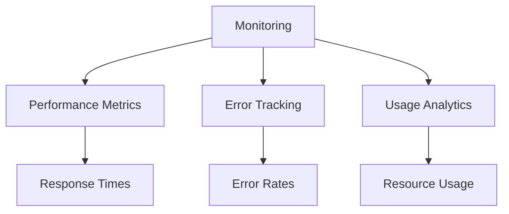

## Security Measures

### 1. Input Validation

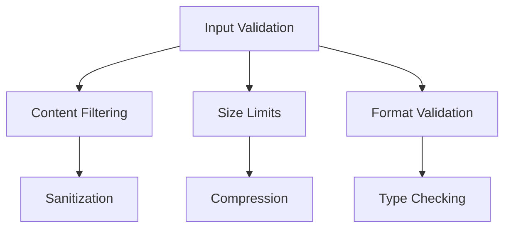

### 2. API Security

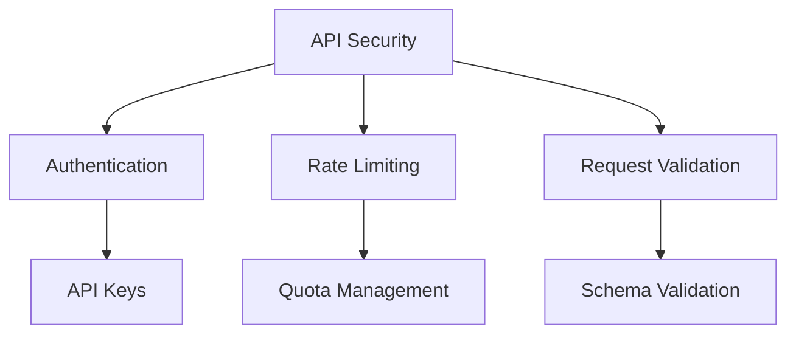

### 3. Storage Security

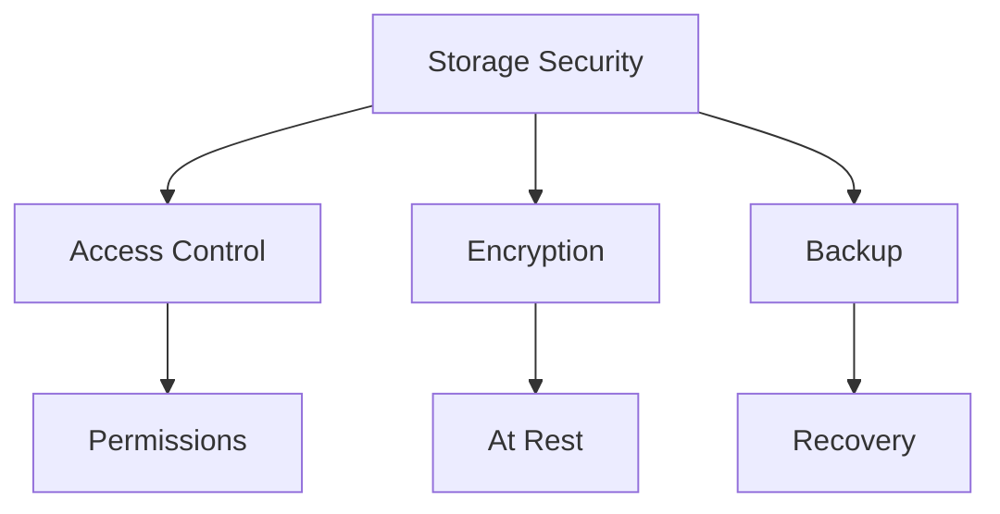

## Future Enhancements

### 1. Scalability

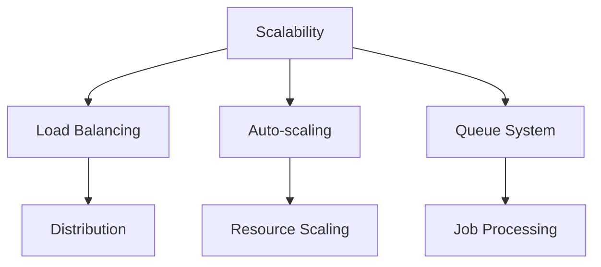

### 2. Features

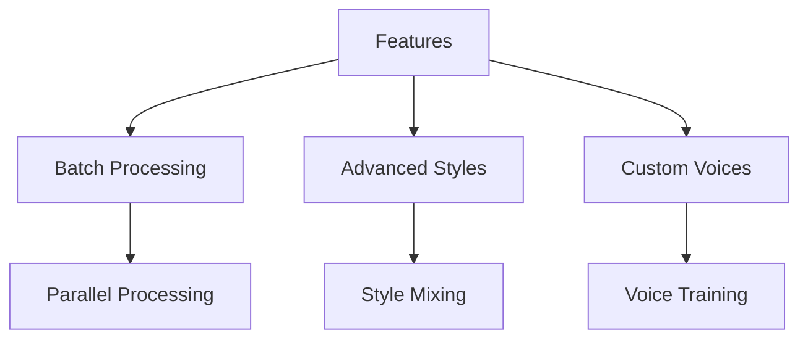

### 3. Optimization

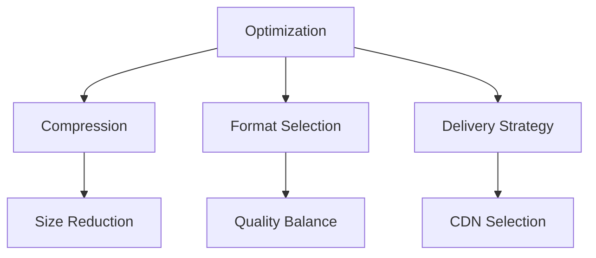

> **Note**: The color scheme used in the diagrams follows a consistent pattern:
> - Input: Blue (#3B82F6)
> - Processing: Purple (#8B5CF6)
> - Storage: Green (#10B981)
> - Delivery: Orange (#F59E0B)
> - Error: Red (#EF4444)
> - Success: Green (#10B981)
> - Warning: Yellow (#F59E0B)
> - Info: Blue (#3B82F6) 