# State Management

> **Note**: This document details the application's state management approach, including global state, component state, and state synchronization.

## Overview

The application uses Jotai for state management, with a focus on atomic state management and derived state. This document outlines the key state management patterns and implementations.

## Audio State Management

### Core Audio State

```typescript
// Base audio context state
interface AudioContextState {
  isInitialized: boolean
  error: Error | null
  activeTrack: AudioTrack | null
  availableTracks: Map<string, AudioTrack>
}

// Audio track state
interface AudioTrack {
  id: string
  url: string
  alignment: AudioAlignment | null
  isPlaying: boolean
  currentTime: number
  duration: number
  volume: number
}

// Audio alignment state
interface AudioAlignment {
  characters: string[]
  character_start_times_seconds: number[]
  character_end_times_seconds: number[]
}
```

### State Atoms

```typescript
// Base state atom
export const audioContextStateAtom = atom<AudioContextState>({
  isInitialized: false,
  error: null,
  activeTrack: null,
  availableTracks: new Map()
})

// Derived state atoms
export const isPlayingAtom = atom(
  (get) => get(audioContextStateAtom).activeTrack?.isPlaying ?? false,
  (get, set, isPlaying: boolean) => {
    const state = get(audioContextStateAtom)
    if (state.activeTrack) {
      set(audioContextStateAtom, {
        ...state,
        activeTrack: { ...state.activeTrack, isPlaying }
      })
    }
  }
)

export const currentTimeAtom = atom(
  (get) => get(audioContextStateAtom).activeTrack?.currentTime ?? 0,
  (get, set, time: number) => {
    const state = get(audioContextStateAtom)
    if (state.activeTrack) {
      set(audioContextStateAtom, {
        ...state,
        activeTrack: { ...state.activeTrack, currentTime: time }
      })
    }
  }
)
```

### State Flow

```mermaid
graph TD
    %% State definition
    subgraph State["📋 Audio State Management"]
        direction TB
        A["🧠 audioContextStateAtom<br><i>(Base State Atom)</i>"]:::atom
        B["⏯️ isPlayingAtom<br><i>(Derived State)</i>"]:::atom
        C["⏱️ currentTimeAtom<br><i>(Derived State)</i>"]:::atom
        D["🔊 volumeAtom<br><i>(Derived State)</i>"]:::atom
        E["🎵 activeTrackAtom<br><i>(Derived State)</i>"]:::atom
    end

    %% Action flows
    subgraph Actions["🎮 User Actions"]
        direction TB
        G["▶️ Play/Pause<br><i>(User Event)</i>"]:::action --> B
        H["🔍 Seek<br><i>(User Event)</i>"]:::action --> C
        I["🔉 Volume Change<br><i>(User Event)</i>"]:::action --> D
        J["🔄 Track Change<br><i>(User Event)</i>"]:::action --> E
    end

    %% Component connections
    subgraph Components["📱 UI Components"]
        direction TB
        K["🎮 AudioPlayer<br><i>(Parent Component)</i>"]:::component
        L["📊 AudioWaveform<br><i>(Visual Component)</i>"]:::component
        M["📝 AnimatedTranscript<br><i>(Text Component)</i>"]:::component
        N["⏯️ PlaybackControls<br><i>(Control Component)</i>"]:::component
        
        K --> L
        K --> M
        K --> N
    end

    %% State to component flows
    A --> B
    A --> C
    A --> D
    A --> E
    
    B --> K
    C --> K
    D --> K
    E --> K
    
    B --> N
    C --> L
    C --> M
    E --> M

    %% Define styles
    classDef atom fill:#EC4899,stroke:#DB2777,color:white,stroke-width:2px;
    classDef action fill:#3B82F6,stroke:#2563EB,color:white,stroke-width:2px;
    classDef component fill:#8B5CF6,stroke:#7C3AED,color:white,stroke-width:2px;
```



> 💡 **Legend**:
> - **Pink nodes** represent state atoms
> - **Blue nodes** represent user actions
> - **Purple nodes** represent UI components
> - Arrows show data flow direction

### State Updates

State updates are handled through atomic operations:

```typescript
// Example: Updating playback state
const handlePlayPause = () => {
  set(isPlayingAtom, !get(isPlayingAtom))
}

// Example: Seeking to a specific time
const handleSeek = (time: number) => {
  set(currentTimeAtom, time)
}

// Example: Changing volume
const handleVolumeChange = (volume: number) => {
  set(volumeAtom, volume)
}
```

### State Persistence

Audio state is persisted in the following ways:

1. **Local Storage**:
   - Volume preferences
   - Playback position
   - Track history

2. **Database**:
   - Audio tracks
   - Alignment data
   - Generation history

### Error Handling

State errors are managed through the error field in the base state:

```typescript
// Example: Error handling in state updates
try {
  await updateAudioState(newState)
} catch (error) {
  set(audioContextStateAtom, (prev) => ({
    ...prev,
    error: error instanceof Error ? error : new Error('Unknown error')
  }))
}
```

### State Synchronization

State is synchronized across components using Jotai's subscription system:

```typescript
// Example: Subscribing to state changes
useEffect(() => {
  const unsubscribe = subscribe(audioContextStateAtom, (state) => {
    // Handle state changes
    console.log('Audio state changed:', state)
  })
  
  return () => unsubscribe()
}, [])
```

## State Architecture


## State Flow


## Implementation Details

### 1. Global State (Jotai)

```typescript
// Atoms
const userEmailAtom = atom<string | null>(null)
const imageGenerationAtom = atom<ImageGenerationState>({
  loading: false,
  error: null,
  imageUrl: null,
  status: 'idle'
})

// Derived Atoms
const userNewsHistoryAtom = atom(async (get) => {
  const email = get(userEmailAtom)
  if (!email) return []
  return await fetchUserNewsHistory(email)
})

// Write-only Atoms
const updateNewsAtom = atom(
  null,
  async (get, set, news: NewsItem) => {
    const email = get(userEmailAtom)
    if (!email) return
    await saveNewsToHistory(news, email)
  }
)
```

### 2. Context State

```typescript
// Theme Context
interface ThemeContextType {
  theme: 'light' | 'dark'
  toggleTheme: () => void
  colors: ThemeColors
}

// Auth Context
interface AuthContextType {
  user: User | null
  login: (email: string) => Promise<void>
  logout: () => Promise<void>
  isAuthenticated: boolean
}

// Settings Context
interface SettingsContextType {
  settings: UserSettings
  updateSettings: (settings: Partial<UserSettings>) => void
  resetSettings: () => void
}
```

### 3. Component State

```typescript
// Page State
interface PageState {
  isLoading: boolean
  error: Error | null
  data: NewsItem | null
  filters: NewsFilters
}

// Card State
interface CardState {
  isExpanded: boolean
  isPlaying: boolean
  progress: number
  error: Error | null
}

// Player State
interface PlayerState {
  isPlaying: boolean
  currentTime: number
  duration: number
  volume: number
}
```

## State Updates


## Performance Optimizations

### 1. Selective Updates


### 2. State Splitting


### 3. Batch Updates


## Error Handling


## Testing Strategy

### 1. Unit Tests

```typescript
describe('State Management', () => {
  test('Jotai atom updates', () => {
    const store = createStore()
    store.set(userEmailAtom, 'test@example.com')
    expect(store.get(userEmailAtom)).toBe('test@example.com')
  })

  test('Context updates', () => {
    const { result } = renderHook(() => useTheme())
    act(() => {
      result.current.toggleTheme()
    })
    expect(result.current.theme).toBe('dark')
  })
})
```

### 2. Integration Tests

```typescript
describe('State Integration', () => {
  test('News generation flow', async () => {
    const { result } = renderHook(() => useNews())
    await act(async () => {
      await result.current.fetchAndSaveNews()
    })
    expect(result.current.data).toBeTruthy()
  })
})
```

## Future Improvements

### 1. State Persistence


### 2. Performance


### 3. Developer Experience


> **Note**: The color scheme used in the diagrams follows a consistent pattern:
> - Global State: Purple (#8B5CF6)
> - Component State: Blue (#3B82F6)
> - Context State: Green (#10B981)
> - Server State: Orange (#F59E0B)
> - Atoms: Pink (#EC4899)
> - Error: Red (#EF4444)
> - Success: Green (#10B981)
> - Warning: Yellow (#F59E0B) 