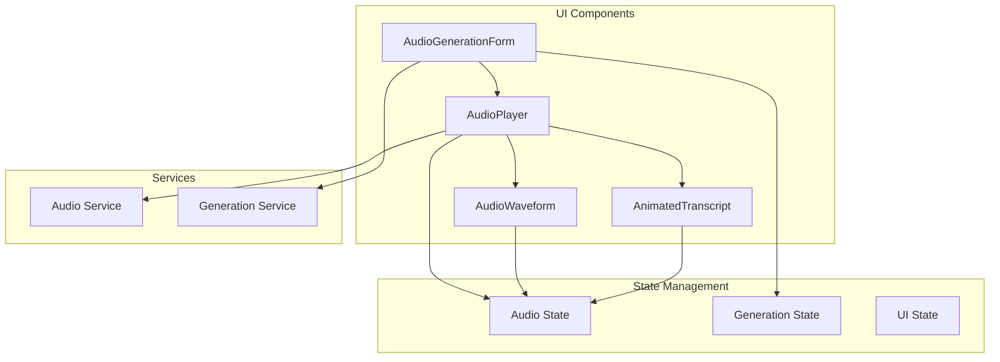
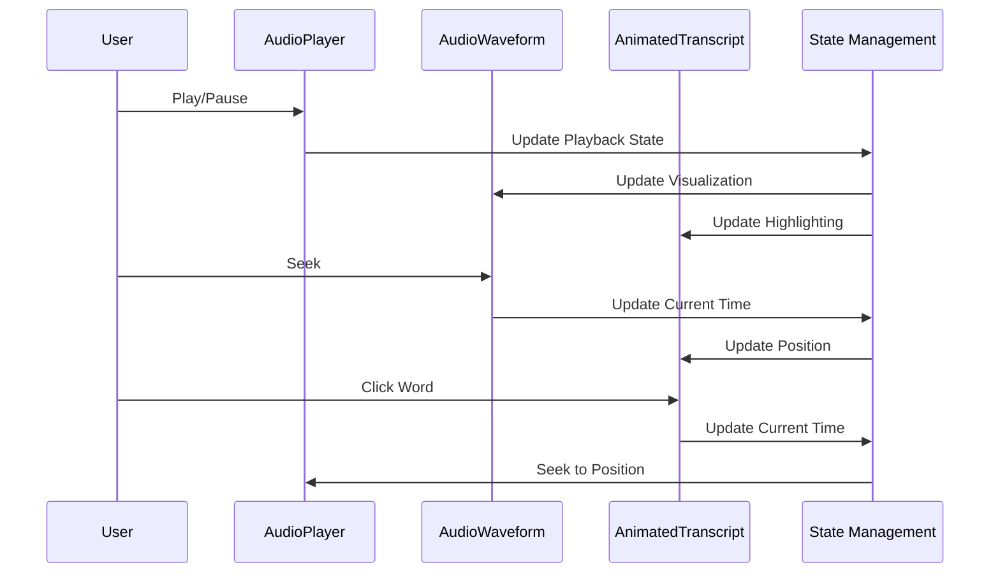

# UI Components

> **Note**: This document details the application's UI component architecture, including component hierarchy, styling approach, and interaction patterns.

## Overview

This document outlines the UI components used in the application, with a focus on audio-related components and their interactions.

## Audio Components

### 1. AudioPlayer

The main audio playback component that handles audio controls and visualization.

```typescript
interface AudioPlayerProps {
  track: AudioTrack
  onPlay?: () => void
  onPause?: () => void
  onSeek?: (time: number) => void
  onVolumeChange?: (volume: number) => void
}
```

#### Features
- Play/pause controls
- Time display and seeking
- Volume control
- Progress bar
- Waveform visualization
- Character-level highlighting

### 2. AudioWaveform

Visualizes the audio frequency data in real-time.

```typescript
interface AudioWaveformProps {
  audioContext: AudioContext
  analyser: AnalyserNode
  isPlaying: boolean
  currentTime: number
  duration: number
  onSeek: (time: number) => void
}
```

#### Features
- Real-time frequency visualization
- Interactive seeking
- Playback position indicator
- Responsive design

### 3. AnimatedTranscript

Displays the text with character-level highlighting based on audio playback.

```typescript
interface AnimatedTranscriptProps {
  text: string
  alignment: AudioAlignment
  currentTime: number
  onWordClick?: (time: number) => void
}
```

#### Features
- Character-level highlighting
- Word-level navigation
- Smooth transitions
- Responsive layout

### 4. AudioGenerationForm

Form component for generating new audio content.

```typescript
interface AudioGenerationFormProps {
  onSubmit: (options: AudioGenerationOptions) => Promise<void>
  onProgress?: (progress: GenerationProgress) => void
}
```

#### Features
- Text input
- Voice selection
- Model selection
- Generation settings
- Progress tracking

### Component Architecture



### Component Interactions



### Styling

Components use a consistent styling system:

```typescript
const styles = {
  container: {
    display: 'flex',
    flexDirection: 'column',
    gap: '1rem',
    padding: '1rem',
    borderRadius: '0.5rem',
    backgroundColor: 'var(--background)',
    boxShadow: 'var(--shadow)'
  },
  controls: {
    display: 'flex',
    alignItems: 'center',
    gap: '0.5rem'
  },
  waveform: {
    height: '100px',
    width: '100%',
    backgroundColor: 'var(--background-alt)',
    borderRadius: '0.25rem'
  },
  transcript: {
    fontFamily: 'var(--font-mono)',
    lineHeight: '1.5',
    padding: '1rem',
    backgroundColor: 'var(--background-alt)',
    borderRadius: '0.25rem'
  }
}
```

### Usage Example

```typescript
function AudioPlayerContainer() {
  const { track, isPlaying, currentTime } = useAudioPlayer()
  const { alignment } = useAudioAlignment()
  
  return (
    <div className={styles.container}>
      <AudioPlayer
        track={track}
        isPlaying={isPlaying}
        currentTime={currentTime}
      />
      
      <AudioWaveform
        audioContext={audioContext}
        analyser={analyser}
        isPlaying={isPlaying}
        currentTime={currentTime}
        duration={track.duration}
        onSeek={handleSeek}
      />
      
      <AnimatedTranscript
        text={track.text}
        alignment={alignment}
        currentTime={currentTime}
        onWordClick={handleWordClick}
      />
    </div>
  )
}
```

### Testing

```typescript
describe('AudioPlayer', () => {
  it('should render playback controls', () => {
    render(<AudioPlayer track={mockTrack} />)
    expect(screen.getByRole('button', { name: /play/i })).toBeInTheDocument()
  })
  
  it('should update progress on playback', () => {
    render(<AudioPlayer track={mockTrack} />)
    const playButton = screen.getByRole('button', { name: /play/i })
    fireEvent.click(playButton)
    
    // Simulate time update
    act(() => {
      jest.advanceTimersByTime(1000)
    })
    
    expect(screen.getByText('0:01')).toBeInTheDocument()
  })
})
```

## Component Hierarchy


## Implementation Details

### 1. Component Structure

```typescript
// Base Component Props
interface BaseComponentProps {
  className?: string;
  children?: React.ReactNode;
  'data-testid'?: string;
}

// News Card Props
interface NewsCardProps extends BaseComponentProps {
  headline: string;
  imageUrl: string;
  audioUrl: string;
  onPlay?: () => void;
  onPause?: () => void;
  onShare?: () => void;
}

// Button Props
interface ButtonProps extends BaseComponentProps {
  variant: 'primary' | 'secondary' | 'outline';
  size: 'sm' | 'md' | 'lg';
  onClick?: () => void;
  disabled?: boolean;
  loading?: boolean;
}
```

### 2. Styling Approach

```typescript
// Tailwind CSS Classes
const buttonStyles = {
  base: 'rounded-md font-medium transition-colors',
  variants: {
    primary: 'bg-blue-600 text-white hover:bg-blue-700',
    secondary: 'bg-gray-200 text-gray-800 hover:bg-gray-300',
    outline: 'border-2 border-blue-600 text-blue-600 hover:bg-blue-50'
  },
  sizes: {
    sm: 'px-3 py-1.5 text-sm',
    md: 'px-4 py-2 text-base',
    lg: 'px-6 py-3 text-lg'
  }
};

// Component Styles
const NewsCard = styled.div`
  @apply rounded-lg shadow-md overflow-hidden;
  background: ${({ theme }) => theme.colors.card};
  transition: transform 0.2s ease;
  
  &:hover {
    transform: translateY(-2px);
  }
`;
```

### 3. State Management

```typescript
// Component State
const [isPlaying, setIsPlaying] = useState(false);
const [progress, setProgress] = useState(0);
const [error, setError] = useState<Error | null>(null);

// Custom Hooks
const useAudioPlayer = (url: string) => {
  const [state, dispatch] = useReducer(audioReducer, initialState);
  const audioRef = useRef<HTMLAudioElement>(null);

  useEffect(() => {
    if (audioRef.current) {
      audioRef.current.src = url;
    }
  }, [url]);

  return {
    ...state,
    audioRef,
    dispatch
  };
};
```

## Performance Optimizations

### 1. Component Memoization


### 2. Lazy Loading


### 3. Virtualization


## Accessibility Features

### 1. ARIA Attributes

```typescript
// Accessible Button
const Button = ({ children, ...props }: ButtonProps) => (
  <button
    role="button"
    aria-label={props['aria-label']}
    aria-disabled={props.disabled}
    aria-busy={props.loading}
    {...props}
  >
    {props.loading ? <Spinner /> : children}
  </button>
);

// Accessible Card
const Card = ({ children, ...props }: CardProps) => (
  <div
    role="article"
    aria-labelledby={props.titleId}
    {...props}
  >
    <h2 id={props.titleId}>{props.title}</h2>
    {children}
  </div>
);
```

### 2. Keyboard Navigation

```typescript
// Keyboard Hook
const useKeyboardNavigation = (options: KeyboardOptions) => {
  const [focusedIndex, setFocusedIndex] = useState(0);
  
  useEffect(() => {
    const handleKeyDown = (event: KeyboardEvent) => {
      switch (event.key) {
        case 'ArrowDown':
          setFocusedIndex(prev => Math.min(prev + 1, options.items.length - 1));
          break;
        case 'ArrowUp':
          setFocusedIndex(prev => Math.max(prev - 1, 0));
          break;
        // ... other keys
      }
    };

    window.addEventListener('keydown', handleKeyDown);
    return () => window.removeEventListener('keydown', handleKeyDown);
  }, [options.items.length]);

  return { focusedIndex, setFocusedIndex };
};
```

### 3. Screen Reader Support

```typescript
// Screen Reader Announcements
const useAnnouncement = () => {
  const announce = (message: string) => {
    const element = document.createElement('div');
    element.setAttribute('aria-live', 'polite');
    element.setAttribute('role', 'status');
    element.textContent = message;
    document.body.appendChild(element);
    setTimeout(() => element.remove(), 1000);
  };

  return { announce };
};
```

## Animation and Transitions

### 1. Framer Motion

```typescript
// Animated Components
const AnimatedCard = motion(Card);

const NewsCard = ({ headline, imageUrl }: NewsCardProps) => (
  <AnimatedCard
    initial={{ opacity: 0, y: 20 }}
    animate={{ opacity: 1, y: 0 }}
    exit={{ opacity: 0, y: -20 }}
    whileHover={{ scale: 1.02 }}
    transition={{ duration: 0.2 }}
  >
    <NewsImage src={imageUrl} alt={headline} />
    <NewsContent>{headline}</NewsContent>
  </AnimatedCard>
);
```

### 2. CSS Transitions

```typescript
// Transition Styles
const transitionStyles = {
  fade: 'transition-opacity duration-200 ease-in-out',
  slide: 'transition-transform duration-300 ease-out',
  scale: 'transition-transform duration-200 ease-in-out',
  color: 'transition-colors duration-150 ease-in-out'
};

// Component with Transitions
const Button = styled.button`
  ${transitionStyles.fade}
  ${transitionStyles.color}
  
  &:hover {
    opacity: 0.9;
    background-color: ${({ theme }) => theme.colors.hover};
  }
`;
```

## Testing Strategy

### 1. Unit Tests

```typescript
// Component Tests
describe('NewsCard', () => {
  it('renders with required props', () => {
    const props = {
      headline: 'Test Headline',
      imageUrl: 'test.jpg',
      audioUrl: 'test.mp3'
    };
    
    render(<NewsCard {...props} />);
    expect(screen.getByText('Test Headline')).toBeInTheDocument();
  });

  it('handles play/pause correctly', () => {
    const onPlay = jest.fn();
    const onPause = jest.fn();
    
    render(
      <NewsCard
        headline="Test"
        imageUrl="test.jpg"
        audioUrl="test.mp3"
        onPlay={onPlay}
        onPause={onPause}
      />
    );
    
    fireEvent.click(screen.getByRole('button', { name: /play/i }));
    expect(onPlay).toHaveBeenCalled();
  });
});
```

### 2. Integration Tests

```typescript
// Integration Tests
describe('NewsCard Integration', () => {
  it('loads and displays news content', async () => {
    render(<NewsSection />);
    
    // Wait for data to load
    await waitFor(() => {
      expect(screen.getByTestId('news-card')).toBeInTheDocument();
    });
    
    // Check content
    expect(screen.getByText(/headline/i)).toBeInTheDocument();
    expect(screen.getByRole('img')).toBeInTheDocument();
  });
});
```

## Future Improvements

### 1. Performance


### 2. Accessibility


### 3. Developer Experience


> **Note**: The color scheme used in the diagrams follows a consistent pattern:
> - Layout Components: Orange (#F59E0B)
> - Feature Components: Blue (#3B82F6)
> - Shared Components: Green (#10B981)
> - State Management: Purple (#8B5CF6)
> - Page Layer: Pink (#EC4899)
> - Component Layer: Blue (#3B82F6)
> - Error: Red (#EF4444)
> - Success: Green (#10B981)
> - Warning: Yellow (#F59E0B) 